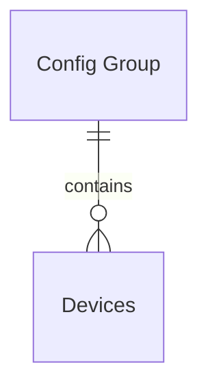

# IoT Agent API

<!-- TOC -->

-   [Preface](#preface)
-   [Topics](#topics)
    -   [Terminology](#terminology)
    -   [IoT Agent information model](#iot-agent-information-model)
        -   [Config groups](#config-groups)
        -   [Devices](#devices)
        -   [Uniqueness of groups and devices](#uniqueness-of-groups-and-devices)
    -   [Special measures and attributes names](#special-measures-and-attributes-names)
    -   [Device to NGSI Mapping](#device-to-ngsi-mapping)
    -   [Device autoprovision and entity creation](#device-autoprovision-and-entity-creation)
    -   [Entity Name expression support](#entity-name-expression-support)
    -   [Multientity support](#multientity-support)
    -   [Metadata support](#metadata-support)
        -   [NGSI LD data and metadata considerations](#ngsi-ld-data-and-metadata-considerations)
    -   [Advice on Attribute definitions](#advice-on-attribute-definitions)
        -   [Reuse of attribute names](#reuse-of-attribute-names)
        -   [Reuse of attribute types](#reuse-of-attribute-types)
        -   [How to specify attribute Units of Measurement](#how-to-specify-attribute-units-of-measurement)
    -   [Measurement persistence options](#measurement-persistence-options)
        -   [Autoprovision configuration (autoprovision)](#autoprovision-configuration-autoprovision)
        -   [Explicitly defined attributes (explicitAttrs)](#explicitly-defined-attributes-explicitattrs)
        -   [Differences between `autoprovision`, `explicitAttrs`](#differences-between-autoprovision-explicitattrs)
    -   [Expression language support](#expression-language-support)
        -   [Examples of JEXL expressions](#examples-of-jexl-expressions)
        -   [Available functions](#available-functions)
        -   [Expressions with multiple transformations](#expressions-with-multiple-transformations)
        -   [Expression support in metadata](#expression-support-in-metadata)
    -   [Measurement transformation](#measurement-transformation)
        -   [Measurement transformation definition](#measurement-transformation-definition)
        -   [Measurement transformation execution](#measurement-transformation-execution)
        -   [Measurement transformation order](#measurement-transformation-order)
        -   [Multientity measurement transformation support (`object_id`)](#multientity-measurement-transformation-support-object_id)
    -   [Command execution](#command-execution)
        -   [Triggering commands](#triggering-commands)
        -   [Command reception](#command-reception)
        -   [Command confirmation](#command-confirmation)
    -   [TimeInstant and Timestamp flag](#timeinstant-and-timestamp-flag)
    -   [Multimeasure support](#multimeasure-support)
    -   [Overriding global Context Broker host](#overriding-global-context-broker-host)
    -   [Multitenancy, FIWARE Service and FIWARE ServicePath](#multitenancy-fiware-service-and-fiware-servicepath)
    -   [Secured access to the Context Broker](#secured-access-to-the-context-broker)
    -   [NGSI-LD support](#ngsi-ld-support)
        -   [NGSI-LD `GeoProperty` support](#ngsi-ld-geoproperty-support)
        -   [NGSI-LD Linked Data support](#ngsi-ld-linked-data-support)
        -   [NGSI-LD `datasetId` support](#ngsi-ld-datasetid-support)
-   [API Routes](#api-routes)
    -   [Config group API](#config-group-api)
        -   [Config group datamodel](#config-group-datamodel)
        -   [Config group operations](#config-group-operations)
            -   [Retrieve config groups `GET /iot/groups`](#retrieve-config-groups-get-iotgroups)
            -   [Create config group `POST /iot/groups`](#create-config-group-post-iotgroups)
            -   [Modify config group `PUT /iot/groups`](#modify-config-group-put-iotgroups)
            -   [Remove config group `DELETE /iot/groups`](#remove-config-group-delete-iotgroups)
    -   [Device API](#device-api)
        -   [Device datamodel](#device-datamodel)
        -   [Device operations](#device-operations)
            -   [Retrieve devices /iot/devices `GET /iot/devices`](#retrieve-devices-iotdevices-get-iotdevices)
            -   [Create device `POST /iot/devices`](#create-device-post-iotdevices)
            -   [Get device details `GET /iot/devices/:deviceId`](#get-device-details-get-iotdevicesdeviceid)
            -   [Modify device `PUT /iot/devices/:deviceId`](#modify-device-put-iotdevicesdeviceid)
            -   [Remove device `DELETE /iot/devices/:deviceId`](#remove-device-delete-iotdevicesdeviceid)
        -   [Batch Operations](#batch-operations)
            -   [Remove devices `POST /iot/op/delete`](#remove-devices-post-iotopdelete)
    -   [Miscellaneous API](#miscellaneous-api)
        -   [Log operations](#log-operations)
            -   [Modify Loglevel `PUT /admin/log`](#modify-loglevel-put-adminlog)
            -   [Retrieve log level `GET /admin/log`](#retrieve-log-level-get-adminlog)
        -   [About operations](#about-operations)
            -   [List IoTA Information `GET /iot/about`](#list-iota-information-get-iotabout)
        -   [Metrics](#metrics)
            -   [Retrieve metrics `GET /metrics`](#retrieve-metrics-get-metrics)

<!-- /TOC -->

# Preface

The IoT Agent mission is to provide a common abstraction layer between the devices and the NGSI entities stored in
Context Broker. In order to achieve this, the IoT Agent sits between the Context Broker and a set of devices. It is in
charge of translating the information coming from the devices into NGSI requests and viceversa.

The **IoT Agent node library** is a Node.js module that can be used to implement IoT Agents. It provides a set of common
functionality that can be used to implement the different IoT Agents, offering a simple REST API which provides common
functionality to access, provision and decommission devices and config groups of devices. This document describes the
API provided by the IoT Agent node library.

# Topics

## Terminology

-   **Devices**: A resource that match physical devices that are connected to the IoT Agent. Each device has a set of
    attributes that can be read or written and a set of commands that can be invoked. The device is identified by a
    `device_id` and points particular entity in the context broker.
-   **Config Groups**: Also known as `provisioning groups` or `service groups`. A logical group of devices. Each Config
    Group has a set of attributes that can be read or written. The config group is identified by a an `apikey`, used to
    authenticate the requests coming from the devices.
-   **Measurements**: A set of values that are sent by a device to the IoT Agent.
-   **Service**: It is the `FIWARE-Service` that the device or config group belongs to.
-   **Subservice**: It is the specific `FIWARE-ServicePath` that the device or config group belongs to.
-   **provision**: The process of creating a new device. A device provisioned means that the device has been already
    created in the IoT Agent. It can also refer to the group creation process.
-   **autoprovision**: The process of creating a new device when a measure arrives to the IoT Agent and the device is
    not provisioned yet. The attributes, entity type and other information is taken from the config group, and entity
    name is generated according to the entity type and device ID or as a result of an expression if `entityNameExp` is
    defined.

## IoT Agent information model

IoT Agents models 2 different kinds of resources: devices and config groups. Devices are the physical devices that send
measurements to the IoT Agent. Config groups are logical groups of devices that share the same configuration. A config
group contains zero or more devices.



### Config groups

Config groups provides a template configuration for the all devices that belong to them. This allows to provision a set
of devices with a single operation. They are identified by an `apikey` and a `resource` and mapped to a particular
entity type.

Once a measure is received by the IoT Agent, the `apikey` and `resource` are used to identify the config group to which
the device belongs. The config group is used to map the measure to a particular entity type and to provide the
information needed to interact with the Context Broker.

If the device already exists in the Context Broker, the IoT Agent will update the entity with the new values. If the
device does not exist, the IoT Agent will create it with the information provided by the config group and eventually
will also create the entity in the Context Broker. This last operation is only possible if the IoT Agent is configured
to use autoprovisioning.

For every config group, the pair (resource, apikey) _must_ be unique (as it is used to identify which group to assign to
which device). Those operations of the API targeting specific resources will need the use of the `resource` and `apikey`
parameters to select the appropriate instance.

Config groups can be created with preconfigured sets of attributes, service and subservice information, security
information and other parameters. The specific parameters that can be configured for a given config group are described
in the [Config group datamodel](#config-group-datamodel) section.

### Devices

A device contains the information that connects a physical device to a particular entity in the Context Broker. Devices
are identified by a `device_id`, and they are associated to an existing config group based in `apikey` matching. For
instance, let's consider a situation in which a config group has been provisioned with `type=X`/`apikey=111` and no
other config group has been provisioned.

The IoT Agents offer a provisioning API where devices can be preregistered, so all the information about service and
subservice mapping, security information and attribute configuration can be specified in a per device way instead of
relaying on the config group configuration. The specific parameters that can be configured for a given device are
described in the [Device datamodel](#device-datamodel) section.

If devices are not pre-registered, they will be automatically created when a measure arrives to the IoT Agent - this
process is known as autoprovisioning. The IoT Agent will create an empty device with the group `apikey` and `type` - the
associated document created in database doesn't include config group parameters (in particular, `timestamp`,
`explicitAttrs`, `active` or `attributes`, `static` and `lazy` attributes and commands). The IoT Agent will also create
the entity in the Context Broker if it does not exist yet.

This behavior allows that autoprovisioned parameters can freely established modifying the device information after
creation using the provisioning API. However, note that if a device (autoprovisioned or not) doesn't have these
parameters defined at device level in database, the parameters are inherit from config group parameters.

### Uniqueness of groups and devices

Group uniqueness is defined by the combination of: resource and apikey.

Device uniqueness is defined by the combination of: service, subservice, device_id and apikey. Note that several devices
with the same device_id are allowed in the same service and subservice as long as their apikeys are different.

## Special measures and attributes names

In case of arriving measures with name `id` or `type`, they are automatically transformed to `measure_id` and
`measure_type` attributes at Context Broker update. The reason behind this is to avoid to collide with the original
entity ID and type, as mechanism that enable store measure values from parameters called with the same name. It only
applies to autoprovisioned attributes and is also available at JEXL context with the same name (`measure_id` or
`measure_type`).

In case of provisioning attributes using `id` or `type` as names (please don't do that ;), they are ignored.

## Device to NGSI Mapping

The way to map the information coming or going to the device to the NGSI attributes is defined in the group or device.
It is possible to define the entity type and the entity ID that a device will use in the Context Broker. It can be
configured for a single device in the device provisioning, or it can be defined for all the devices in a group.

The entity type should be defined both in the group and in the device, but the entity name (entity ID) is not defined in
the group. In that case, if there is no a existing device the same device ID, the entity name of the device generated
will be a concatenation of the entity type and the device ID (I.E: `entityType:device_id`). If you need to generate the
entity name differently, it is possible to define an expression to generate it, using the parameter `entityNameExp` in
the group as described in the [Entity Name expression support](#entity-name-expression-support) section.

It is also possible to configure how each of the measures obtained from the device is mapped to different attributes.
The name and type of the attribute is configured by the user (globally for all the devices in the group or in a per
device preprovisioning). Device measures can have four different behaviors:

-   **`attributes`**: Are measures that are pushed from the device to the IoT agent. This measure changes will be sent
    to the Context Broker as updateContext requests over the device entity. NGSI queries to the context broker will be
    resolved in the Broker database. For each attribute, its `name` and `type` must be provided. Additional `metadata`
    is optional. They are called internally as _active attributes_.

-   **`lazy`**: Passive measures that are pulled from the device to the IoT agent. When a request for data from a lazy
    attribute arrives to the Context Broker, it forwards the request to the IoT Agent (that behaves as NGSI Context
    Provider for all the lazy attributes or commands). The IoT Agent will then ask the device for the information
    needed, transform that information to a NGSI format and return it to the Context Broker. This operation will be
    synchronous from the customer perspective: the Context Broker won't return a response until the device has returned
    its response to the IoT Agent. For each attribute, its `name` and `type` must be provided. They are called
    internally as _lazy attributes_.

-   **`static`**: It is static attributes that are persisted in the Context Broker. They are not updated by the device,
    but they can be modified by the user. They are useful to store information about the device that is not updated by
    the device itself. For instance, a `location` static attribute is can be used to store the location of a fixed
    device.

-   **`commands`**: Commands are actions that can be invoked in the device. They are entity attributes, but they are not
    updated by the device, they are updated by the Context Broker. In this case, the interaction will begin by setting
    an attribute in the device's entity, for which the IoT Agent will be regitered as Context Provider. The IoT Agent
    will return an immediate response to the Context Broker, and will be held responsible of contacting the device to
    perform the command itself using the device specific protocol. Special `status` and `info` attributes should be
    update. For each command, its `name` and `type` must be provided. For further information, please refer to
    [Command execution](#command-execution) section.

All of them have the same syntax, a list of objects with the following attributes:

-   **object_id** (optional): name of the attribute as coming from the device.
-   **name** (mandatory): ID of the attribute in the target entity in the Context Broker. Note that `id` and `type` are
    not valid attribute names at Context Broker. Thus, although a measure named `id` or `type` will not break the IoT
    Agent, they are silently ignored and never progress toward Context Broker entities.
-   **type** (mandatory): name of the type of the attribute in the target entity.
-   **metadata** (optional): additional static metadata for the attribute in the target entity. (e.g. `unitCode`)

Some advanced features also allow the use of the following optional fields:

-   **expression**: indicates that the value of the target attribute will not be the plain value or the measurement, but
    an expression based on a combination of the reported values. See the
    [Expression Language definition](#expression-language-support) for details
-   **skipValue**: indicates that if the result of applying `expression` to a measure is equal to the value of
    `skipValue` then the attribute corresponding to the measure is not sent to CB. In other words, this field **is not
    an expression**, it is a value that is compared with the result of applying `expression` to a measure. By default if
    `skipValue` is not defined then is considered as `null` (i.e. if the result of apply `expression` results in `null`
    then corresponding attribute is not sent to CB). It is only used if `expression` is provided (otherwise is ignored).
-   **entity_name**: the presence of this attribute indicates that the value will not be stored in the original device
    entity but in a new entity with an ID given by this attribute. The type of this additional entity can be configured
    with the `entity_type` attribute. If no type is configured, the device entity type is used instead. Entity names can
    be defined as expressions, using the [Expression Language definition](#expression-language-support).
-   **entity_type**: configures the type of an alternative entity.

Additionally for commands (which are attributes of type `command`) the following fields are optional:

-   **expression** indicates that the value of the target command will not be the plain value or the command, but an
    expression based on a combination of the returned values. See the
    [Expression Language definition](#expression-language-support) for details
-   **payloadType**: indicates how command payload will be transformed before be sent to device. Please have a look to
    particular IOTAs documentation for allowed values of this field in each case.
-   **contentType**: `content-type` header used when send command by HTTP transport (ignored in other kinds of
    transports)

Note that, when information coming from devices, this means measures, are not defined neither in the group, nor in the
device, the IoT agent will store that information into the destination entity using the same attribute name than the
measure name, unless `explicitAttrs` is defined. Measures `id` or `type` names are invalid, and will be ignored.

## Device autoprovision and entity creation

For those agents that uses IoTA Node LIB version 3.4.0 or higher, you should consider that the entity is not created
automatically when a device is created. This means that all entities into the Context Broker are created when data
arrives from a device, no matter if the device is explicitly provisioned (via
[device provisioning API](#create-device-post-iotdevices)) or autoprovisioned.

If for any reason you need the entity at CB before the first measure of the corresponding device arrives to the
IOTAgent, you can create it in advance using the Context Broker
[NGSI v2 API](https://github.com/telefonicaid/fiware-orion/blob/master/doc/manuals/orion-api.md).

## Entity Name expression support

By default, the entity name used to persist the device measures in the Context Broker can be defined in the device
provisioning or, if the device is autoprovisioned, it is generated by the IoT Agent as a concatenation of the entity
type and the device ID. If you need to generate the entity name differently, it is possible to define an expression to
generate it, using the [Expression Language](#expression-language-support) through the `entityNameExp` field in the
group.

With this feature, the entity name can be generated dynamically based not only on the device ID and entity type, but
also on the measures reported by the device or any other context information. The `entityNameExp` field is only
available at the group level. **Important**: when using `entityNameExp`, the `entity_name` field in the device
provisioning is ignored. This means that the entity name used to store the device information in the Context Broker is
always generated by the `entityNameExp` expression. If you need to explicitly define the entity name for a particular
device, you can include a particular condition in the `entityNameExp` expression to handle that case (e.g.
`id == 'myDevice' ? 'myEntity' : entityType + ':' + id`).

The following example shows how to define an entity name expression:

```json
{
    "services": [
        {
            "resource": "/json",
            "apikey": "801230BJKL23Y9090DSFL123HJK09H324HV8732",
            "entity_type": "TemperatureSensor",
            "entityNameExp": "id + '__' + sn",
            "attributes": [
                {
                    "object_id": "t",
                    "name": "temperature",
                    "type": "Number"
                },
                {
                    "object_id": "sn",
                    "name": "serialNumber",
                    "type": "Text"
                }
            ]
        }
    ]
}
```

As defined above, the `entityNameExp` is `id + '__' + sn` and it will generate the entity name by concatenating the
device ID and the serial number reported by the device. For example, for a given measure with `id` equal to `dev123` and
`sn` equal to `ABCDEF`, the resulting entity name will be `dev123__ABCDEF`.

Note that, when using `entityNameExp`, the `entity_name` of the device provisioning is set to the result of the
expression the first time the device is created. If the expression is modified later, the `entity_name` of the device
provisioning will not be updated, but the value used to persist the device measures in the Context Broker will be the
result of the new expression. This can lead to a situation where the `entity_name` of the device provisioning and the
entity name used in the Context Broker are different.

## Multientity support

The IOTA is able to persists measures coming from a single device to more than one entity, declaring the target entities
through the config group or device provision APIs.

```json
{
    "devices": [
        {
            "protocol": "IoTA-UL",
            "entity_name": "urn:ngsi-ld:Device:contador12",
            "entity_type": "multientity",
            "attributes": [
                {
                    "object_id": "cont1",
                    "name": "vol",
                    "type": "Text",
                    "entity_name": "urn:ngsi-ld:Device:WaterMeterSoria01",
                    "entity_type": "WaterMeter"
                },
                {
                    "object_id": "cont2",
                    "name": "vol",
                    "type": "Text",
                    "entity_name": "urn:ngsi-ld:Device:WaterMeterSoria02",
                    "entity_type": "WaterMeter"
                },
                {
                    "object_id": "cont3",
                    "name": "vol",
                    "type": "Text",
                    "entity_name": "urn:ngsi-ld:Device:WaterMeterSoria03",
                    "entity_type": "WaterMeter"
                }
            ],
            "device_id": "contador12"
        }
    ]
}
```

## Metadata support

Both `attributes` and `static_attributes` may be supplied with metadata when creating a config group, so that the units
of measurement can be placed into the resultant entity.

e.g.:

```json
{
    "entity_type": "Lamp",
    "resource": "/iot/d",
    "protocol": "PDI-IoTA-UltraLight",
    "commands": [
        { "name": "on", "type": "command" },
        { "name": "off", "type": "command" }
    ],
    "attributes": [
        { "object_id": "s", "name": "state", "type": "Text" },
        {
            "object_id": "l",
            "name": "luminosity",
            "type": "Integer",
            "metadata": {
                "unitCode": { "type": "Text", "value": "CAL" }
            }
        }
    ],
    "static_attributes": [
        { "name": "category", "type": "Text", "value": ["actuator", "sensor"] },
        {
            "name": "controlledProperty",
            "type": "Text",
            "value": ["light"],
            "metadata": {
                "includes": { "type": "Text", "value": ["state", "luminosity"] },
                "alias": { "type": "Text", "value": "lamp" }
            }
        }
    ]
}
```

### NGSI-LD data and metadata considerations

When provisioning devices for an NGSI-LD Context Broker, `type` values should typically correspond to one of the
following:

-   `Property`, `Relationship`, `GeoProperty`, `LanguageProperty`
-   Native JSON types (e.g. `String`, `Boolean`, `Float` , `Integer` `Number`)
-   Temporal Properties (e.g. `Datetime`, `Date` , `Time`)
-   GeoJSON types (e.g `Point`, `LineString`, `Polygon`, `MultiPoint`, `MultiLineString`, `MultiPolygon`)

Most NGSI-LD attributes are sent to the Context Broker as _properties_. If a GeoJSON type or native JSON type is
defined, the data will be converted to the appropriate type. Temporal properties should always be expressed in UTC,
using ISO 8601. This ISO 8601 conversion is applied automatically for the `observedAt` _property-of-a-property_ metadata
where present.

Data for any attribute defined as a _relationship_ must be a valid URN.

Note that when the `unitCode` metadata attribute is supplied in the provisioning data under NGSI-LD, the standard
`unitCode` _property-of-a-property_ `String` attribute is created.

Other unrecognised `type` attributes will be passed as NGSI-LD data using the following JSON-LD format:

```json
    "<property_name>": {
       "type" : "Property",
       "value": {
          "@type":  "<property_type>",
          "@value":  { string or object}
      }
    }
```

`null` values will be passed in the following format:

```json
     "<property_name>": {
       "type" : "Property",
       "value": {
          "@type":  "Intangible",
          "@value":  null
      }
    }
```

## Advice on Attribute definitions

### Reuse of attribute names

Check for the existence of the same Attribute on any of the other models and reuse it, if pertinent. Have a look at
schema.org trying to find a similar term with the same semantics. Try to find common used ontologies or existing
standards well accepted by the Community, or by goverments, agencies, etc. For instance, Open311 for civic issue
tracking or Datex II for transport systems.

### Reuse of attribute types

When possible reuse [schema.org](http://schema.org/) data types (`Text`, `Number`, `DateTime`, `StructuredValue`, etc.).
Remember that `null` is not allowed in NGSI-LD and therefore should be avoided as a value.

### How to specify attribute Units of Measurement

If your data use the default unit defined in the Data Model, you don't need to specify any. It is implied. Unless
explicitly stated otherwise, all FIWARE data models use the metric system of measurements by default. Regardless the
model specification include explicit reference to the scale adopted. If your data use a different unit, you will need to
use the `unitCode` metadata annotation in your data (and you will need to adopt the normalised representation). The code
used should be taken from those defined by
[UN/CEFACT](https://www.unece.org/fileadmin/DAM/cefact/recommendations/rec20/rec20_rev3_Annex3e.pdf). E.g.:

```json
{
    "object_id": "l",
    "name": "length",
    "type": "Integer",
    "metadata": {
        "unitCode": { "type": "Text", "value": "FOT" }
    }
}
```

## Measurement persistence options

There are 2 different options to configure how the IoTAgent stores the measures received from the devices, depending on
the following parameters:

-   `autoprovision`: If the device is not provisioned, the IoTAgent will create a new device and entity for it.
-   `explicitAttrs`: If the measure element (object_id) is not defined in the mappings of the device or config group
    provision, the measure is stored in the Context Broker by adding a new attribute to the entity with the same name of
    the undefined measure element.

### Autoprovision configuration (autoprovision)

By default, when a measure arrives to the IoTAgent, if the `device_id` does not match with an existing one, then, the
IoTA creates a new device and a new entity according to the config group. Defining the field `autoprovision` to `false`
when provisioning the config group, the IoTA to reject the measure at the southbound, allowing only to persist the data
to devices that are already provisioned. It makes no sense to use this field in device provisioning since it is intended
to avoid provisioning devices (and for it to be effective, it would have to be provisional). Further information can be
found in section [Devices](#devices)

### Explicitly defined attributes (explicitAttrs)

If a given measure element (object_id) is not defined in the mappings of the device or config group, the measure is
stored in the Context Broker by adding a new attribute to the entity with the same name of the undefined measure
element. By adding the field `explicitAttrs` with `true` value to device or config group, the IoTAgent rejects the
measure elements that are not defined in the mappings of device or config group, persisting only the one defined in the
mappings of the provision. If `explicitAttrs` is provided both at device and config group level, the device level takes
precedence. Additionally `explicitAttrs` can be used to define which measures (identified by their attribute names, not
by their object_id) defined in JSON/JEXL array will be propagated to NGSI interface.

Note that when `explicitAttrs` is an array or a JEXL expression resulting in to Array, if this array is empty then
`TimeInstant` is not propaged to CB.

The different possibilities are summarized below:

Case 1 (default):

```
"explicitAttrs": false
```

every measure will be propagated to NGSI interface, including all static attributes.

Case 2:

```
"explicitAttrs": true
```

In this case, should only progress active and static attributes defined in the device or group provision (`TimeInstant`
attribute will be also included if enabled), including also all static attributes. In other words, having
`"explicitAttrs":true` would prevent the IoTA creating attributes into the related entity within the context broker from
measures that are not explicitly defined in the device or group provision.

Note that attributes defined in the provision that are not receiving a measure (or having a expression defined that is
resulting `null`) will not progress (this means, the NGSI request to update the entity in the context broker is not
going to include that attribute) unless `skipValue` is defined to other value than `null`

Case 3:

```
"explicitAttrs": "['attr1','atrr2']"
```

just NGSI attributes defined in the array (identified by their attribute names, not by their object_id, plus
conditionally TimeInstant) will be propagated to NGSI interface (note that in this case the value of `explicitAttrs` is
not a JSON but a JEXL Array that looks likes a JSON). Only static attributes included in that array will be propagated
to NGSI interface.

All attributes contained in the array must be defined as `attributes` or `static_attributes`. Not defined measures
(`object_id`) will be dropped, even if they are defined in the `explicitAttrs` array.

Case 4:

```
"explicitAttrs": "['attr1','atrr2',{object_id:'active_id'}]"
```

just NGSI attributes defined in the array (identified by their attribute names and/or by their object_id) will be
propagated to NGSI interface (note that in this case the value of `explicitAttrs` is not a JSON but a JEXL Array/Object
that looks likes a JSON). This is necessary when same attribute names are used within multiple entities. Only static
attributes included in that array will be propagated to NGSI interface.

Note that in the previous case show above, when selecting the object_id (with `{object_id:'active_id'}`), the attribute
must be defined. In other words, it would not work if the attribute with the corresponding `object_id`, is not defined.

Case 5:

```
"explicitAtttr": "<JEXL expression resulting in bool or array>"
```

depending on the JEXL expression evaluation:

-   If it evaluates to `true` every measure will be propagated to NGSI interface (as in case 1)
-   If it evaluates to `false` just measures defined in active, static (plus conditionally TimeInstant) will be
    propagated to NGSI interface (as in case 2)
-   If it evaluates to an array just measures defined in the array (identified by their attribute names, not by their
    object_id) will be will be propagated to NGSI interface (as in case 3)

### Differences between `autoprovision`, `explicitAttrs`

Since those configuration parameters are quite similar, this section is intended to clarify the relation between them.

If `autoprovision` is set to `true` (default case), the agent will perform an initial request creating a new entity into
the Context Broker with **only** the static and active attributes provisioned in the config group, and also a new Device
in the agent, every time a measure arrives with a new `device_id`. Otherwise, this measure is ignored. This is something
related to the **southbound**.

What `explicitAttrs` does is to filter from the southbound the parameters that are not explicitly defined in the device
provision or config group. That also would avoid propagating the measures to the Context Broker.

## Expression language support

The IoTAgent Library provides an expression language for measurement transformation and other purposes. This expression
language is based on the [TomFrost/JEXL](https://github.com/TomFrost/Jexl) library. The common usage of this feature is
to adapt the information coming from the South Bound APIs to the information reported to the Context Broker. This is
really useful when you need to adapt measure (for example, to change the units, or to apply a formula to). All the usage
of expression in the IoT Agent are:

-   [Measurement transformation](#measurement-transformation).
-   [Metadata](#expression-support-in-metadata)
-   Commands payload transformation (push and pull).
-   Auto provisioned devices entity name. It is configured at config Group level by setting the `entityNameExp`
    parameter. It defines an expression to generate the Entity Name for autoprovisioned devices. More information in the
    [Entity Name expression support](#entity-name-expression-support) section.
-   Dynamic `endpoint` definition. Configured at device level, it defines where the device listen for push http
    commands. It can be either a static value or an expression.

The agent provides additional information, hereafter referred as **context**, in order to be used to evaluate the
expression. In all cases the following data is available to all expressions:

-   `id`: device ID
-   `entity_name`: NGSI entity Name (principal)
-   `type`: NGSI entity type (principal)
-   `service`: device service (`Fiware-Service`)
-   `subservice`: device subservice (`Fiware-ServicePath`)
-   `staticAttributes`: static attributes defined in the device or config group

Additionally, for attribute expressions (`expression`, `entity_name`), `entityNameExp` and metadata expressions
(`expression`) the following is available in the **context** used to evalute:

-   measures, as `<AttributeName>`
-   metadata (both for attribute measurement in the case of NGSI-v2 measurements and static attribute) are available in
    the **context** under the following convention: `metadata.<AttributeName>.<MetadataName>` or
    `metadata.<StaticAttributeName>.<MetadataName>` in a similar way of defined for
    [Context Broker](https://github.com/telefonicaid/fiware-orion/blob/master/doc/manuals/orion-api.md#metadata-support)

### Examples of JEXL expressions

The following table shows expressions and their expected outcomes taking into account the following measures at
southbound interface:

-   `value` with value 6 (number)
-   `ts` with value 1637245214901 (unix timestamp)
-   `name` with value `"DevId629"` (string)
-   `object` with value `{name: "John", surname: "Doe"}` (JSON object)
-   `array` with value `[1, 3]` (JSON Array)

| Expression                                    | Expected outcome                          | Format              | Playground    |
| :-------------------------------------------- | :---------------------------------------- | ------------------- | ------------- |
| `5 * value`                                   | `30`                                      | Integer             | [Example][6]  |
| `(6 + value) * 3`                             | `36`                                      | Integer             | [Example][7]  |
| `value / 12 + 1`                              | `1.5`                                     | Float               | [Example][8]  |
| `(5 + 2) * (value + 7)`                       | `91`                                      | Integer             | [Example][9]  |
| `value * 5.2`                                 | `31.2`                                    | Float               | [Example][10] |
| `"Pruebas " + "De Strings"`                   | `"Pruebas De Strings"`                    | String              | [Example][11] |
| `name + "value is " +value`                   | `"DevId629 value is 6"`                   | String              | [Example][12] |
| `{coordinates: [value,value], type: 'Point'}` | `{"coordinates": [6,6], "type": "Point"}` | GeoJSON `Object`    | [Example][13] |
| <code>ts&vert;toisodate</code>                | `2021-11-18T14:20:14.901Z`                | ISO 8601 `DateTime` | [Example][14] |

Support for `trim`, `length`, `substr` and `indexOf` transformations was added.

| Expression                                                | Expected outcome | Playground    |
| :-------------------------------------------------------- | :--------------- | ------------- |
| <code>" a "&vert; trim</code>                             | `a`              | [Example][15] |
| <code>name&vert;length</code>                             | `8`              | [Example][16] |
| <code>name&vert;indexOf("e")</code>                       | `1`              | [Example][17] |
| <code>name&vert;substr(0,name&vert;indexOf("e")+1)</code> | `"De"`           | [Example][18] |

### Available functions

There are several predefined JEXL transformations available to be used at any JEXL expression. The definition of those
transformations and their JavaScript implementation can be found at jexlTransformsMap.js.

The library module also exports a method `iotAgentLib.dataPlugins.expressionTransformation.setJEXLTransforms(Map)` to be
used by specific IoT Agent implementations in order to incorporate extra transformations to this set. It is important to
remark that the lib `jexlTransformsMap` cannot be overwritten by the API additions. The idea behind this is to be able
to incorporate new transformations from the IoT Agent configuration file in a fast and tactical way.

Current common transformation set:

| JEXL Transformation                  | Equivalent JavaScript Function                                                                                           |
| ------------------------------------ | ------------------------------------------------------------------------------------------------------------------------ |
| jsonparse: (str)                     | `JSON.parse(str);`                                                                                                       |
| jsonstringify: (obj)                 | `JSON.stringify(obj);`                                                                                                   |
| indexOf: (val, char)                 | `String(val).indexOf(char);`                                                                                             |
| length: (val)                        | `String(val).length;`                                                                                                    |
| trim: (val)                          | `String(val).trim();`                                                                                                    |
| substr: (val, int1, int2)            | `String(val).substr(int1, int2);`                                                                                        |
| addreduce: (arr)                     | <code>arr.reduce((i, v) &vert; i + v));</code>                                                                           |
| lengtharray: (arr)                   | `arr.length;`                                                                                                            |
| typeof: (val)                        | `typeof val;`                                                                                                            |
| isarray: (arr)                       | `Array.isArray(arr);`                                                                                                    |
| isnan: (val)                         | `isNaN(val);`                                                                                                            |
| parseint: (val)                      | `parseInt(val);`                                                                                                         |
| parsefloat: (val)                    | `parseFloat(val);`                                                                                                       |
| toisodate: (val)                     | `new Date(val).toISOString();`                                                                                           |
| timeoffset:(isostr)                  | `new Date(isostr).getTimezoneOffset();`                                                                                  |
| tostring: (val)                      | `val.toString();`                                                                                                        |
| urlencode: (val)                     | `encodeURI(val);`                                                                                                        |
| urldecode: (val)                     | `decodeURI(val);`                                                                                                        |
| replacestr: (str, from, to)          | `str.replace(from, to);`                                                                                                 |
| replaceregexp: (str, reg, to)        | `str.replace(new RegExp(reg), to);`                                                                                      |
| replaceallstr: (str, from, to)       | `str.replaceAll(from, to);`                                                                                              |
| replaceallregexp: (str, reg, to)     | `str.replaceAll(new RegExp(reg,"g"), to);`                                                                               |
| split: (str, ch)                     | `str.split(ch);`                                                                                                         |
| joinarrtostr: (arr, ch)              | `arr.join(ch);`                                                                                                          |
| concatarr: (arr, arr2)               | `arr.concat(arr2);`                                                                                                      |
| mapper: (val, values, choices)       | <code>choices[values.findIndex((target) &vert; target == val)]);</code>                                                  |
| thmapper: (val, values, choices)     | <code>choices[values.reduce((acc,curr,i,arr) &vert; (acc==0)&vert;&vert;acc?acc:val<=curr?acc=i:acc=null,null)];</code>  |
| bitwisemask: (i,mask,op,shf)         | <code>(op==="&"?parseInt(i)&mask: op==="&vert;"?parseInt(i)&vert;mask: op==="^"?parseInt(i)^mask:i)>>shf;</code>         |
| slice: (arr, init, end)              | `arr.slice(init,end);`                                                                                                   |
| addset: (arr, x)                     | <code>{ return Array.from((new Set(arr)).add(x)) }</code>                                                                |
| removeset: (arr, x)                  | <code>{ let s = new Set(arr); s.delete(x); return Array.from(s) }</code>                                                 |
| touppercase: (val)                   | `String(val).toUpperCase()`                                                                                              |
| tolowercase: (val)                   | `String(val).toLowerCase()`                                                                                              |
| round: (val)                         | `Math.round(val)`                                                                                                        |
| floor: (val)                         | `Math.floor(val)`                                                                                                        |
| ceil: (val)                          | `Math.ceil(val)`                                                                                                         |
| tofixed: (val, decimals)             | `Number.parseFloat(val).toFixed(decimals)`                                                                               |
| gettime: (d)                         | `new Date(d).getTime()`                                                                                                  |
| toisostring: (d)                     | `new Date(d).toISOString()`                                                                                              |
| localestring: (d, timezone, options) | `new Date(d).toLocaleString(timezone, options)`                                                                          |
| now: ()                              | `Date.now()`                                                                                                             |
| hextostring: (val)                   | `new TextDecoder().decode(new Uint8Array(val.match(/.{1,2}/g).map(byte => parseInt(byte, 16))))`                         |
| valuePicker: (val,pick)              | <code>valuePicker: (val,pick) => Object.entries(val).filter(([_, v]) => v === pick).map(([k, _]) => k)</code>            |
| valuePickerMulti: (val,pick)         | <code>valuePickerMulti: (val,pick) => Object.entries(val).filter(([_, v]) => pick.includes(v)).map(([k, _]) => k)</code> |

You have available this [JEXL interactive playground][99] with all the transformations already loaded, in which you can
test all the functions described above.

### Expressions with multiple transformations

When you need to apply multiples transformations to the same value, you can use the pipe character `|` to separate the
transformations. For example, if you want to apply the `trim` and `replacestr` transformations to a value, you can use
the following expression:

```json
{
    "expression": "variable | trim | replacestr('hello','hi')"
}
```

If variable takes value `hello world`, the result of the previous expression will be `hi world`.

Another example using functions that return more than one value is the following:

```json
{
    "expression": "location | split(', ')[1] | parsefloat()"
}
```

For a location value `"40.4165, -3.70256"`, the result of the previous expression will be `-3.70256`.

### Expression support in metadata

Metadata could also has `expression` like attributes in order to expand it:

e.g.:

```json
{
    "entity_type": "Lamp",
    "resource": "/iot/d",
    "protocol": "PDI-IoTA-UltraLight",
    "commands": [
        { "name": "on", "type": "command" },
        { "name": "off", "type": "command" }
    ],
    "attributes": [
        { "object_id": "s", "name": "state", "type": "Text" },
        {
            "object_id": "l",
            "name": "luminosity",
            "type": "Integer",
            "metadata": {
                "unitCode": { "type": "Text", "value": "CAL" }
            }
        }
    ],
    "static_attributes": [
        { "name": "category", "type": "Text", "value": ["actuator", "sensor"] },
        {
            "name": "controlledProperty",
            "type": "Text",
            "value": ["light"],
            "metadata": {
                "includes": { "type": "Text", "value": ["state", "luminosity"], "expression": "level / 100" },
                "alias": { "type": "Text", "value": "lamp" }
            }
        }
    ]
}
```

Note that there is no order into metadata structure and there is no warranty about which metadata attribute expression
will be evaluated first.

## Measurement transformation

The IoTAgent Library provides support for measurement transformation using a
[Expression Language](#expression-language-support) This feature can be used to adapt the information coming from the
South Bound APIs to the information reported to the Context Broker. This is really useful when you need to adapt measure
(for example, to change the units, or to apply a formula to).

### Measurement transformation definition

Measurement transformation can be defined for Active attributes, either in the Device provisioning or in the config
group provisioning. The following example shows a device provisioning payload with defined Measurement transformation:

```json
{
    "devices": [
        {
            "device_id": "45",
            "protocol": "GENERIC_PROTO",
            "entity_name": "WasteContainer:WC45",
            "entity_type": "WasteContainer",
            "attributes": [
                {
                    "name": "location",
                    "type": "geo:json",
                    "expression": "{coordinates: [longitude,latitude], type: 'Point'}"
                },
                {
                    "name": "fillingLevel",
                    "type": "Number",
                    "expression": "level / 100"
                },
                {
                    "name": "level",
                    "type": "Number"
                },
                {
                    "name": "latitude",
                    "type": "Number"
                },
                {
                    "name": "longitude",
                    "type": "Number"
                }
            ]
        }
    ]
}
```

[Interactive expression `{coordinates: [longitude,latitude], type: 'Point'}`][1]

[Interactive expression `level / 100`][2]

The value of the `expression` field defines the measure transformation. is a string that can contain any number of
expression patterns. In order to complete expression to be evaluated, all the expression patterns must be evaluable
(there must be a value in the measurement for all the variables of all the expression patterns).

Note that you need to include in the provision operation all the attributes required as inputs for the expressions. In
this example, they are `level`, `latitude` and `longitude`. Otherwise the device sending the measures will get
`{"name":"ATTRIBUTE_NOT_FOUND","message":"Some of the attributes does not exist"}` when it sends some of these and the
expression will not be calculated.

The exact same syntax works for Configuration and Device provisioning.

### Measurement transformation execution

Whenever a new measurement arrives to the IoT Agent for a device with declared expressions, all of the expressions for
the device will be checked for execution: for all the defined active attributes containing expressions, the IoT Agent
will check which ones contain expressions whose variables are present in the received measurement. For all of those
whose variables are covered, their expressions will be executed with the received values, and their values updated in
the Context Broker.

If as a result of apply expression `undefined` or `null` value is obtained then any of them will not progress to entity
attribute. Have into acount that some numeric operations results (like nonexistent \* 2) are a kind of null with a
number type but NaN value, which will also not progress to entity attribute.

E.g.: if a device with the following provisioning information is created in the IoT Agent:

```json
{
   "name":"location",
   "type":"geo:point",
   "expression": "longitude+', '+latitude"
},
{
   "name":"fillingLevel",
   "type":"Number",
   "expression": "level / 100",
},
```

[Interactive expression `longitude+', '+latitude`][3]

[Interactive expression `level / 100`][4]

and a measurement with the following values arrive to the IoT Agent:

```text
latitude: 1.9
level: 85.3
```

The only expression rule that will be executed will be that of the `fillingLevel` attribute. It will produce the value
`0.853` that will be sent to the Context Broker.

Note that expressions are only applied if the attribute name (as received by the IoT Agent in the southbound interface)
matches the expression variable. Otherwise, the southbound value is used directly. Let's illustrate with the following
example:

```json
"consumption": {
   "type": "String",
   "value": "spaces | trim"
}
```

-   Case 1: the following measure is received at the southbound interface:

```text
consumption: "0.44"
```

As `spaces` attribute is not included, then the expression is not applied and the `consumption` measure value is
directly used, so the following is sent to CB:

```json
"consumption": {
   "type": "String",
   "value": "0.44"
}
```

-   Case 2: the following measure is received at the southbound interface:

```text
consumption: "0.44"
spaces: "  foobar  "
```

As `spaces` attribute is included, then the expression is evaluated, so overriding the 0.44 value and sending the
following to CB:

```json
"consumption": {
    "type": "String",
    "value": "foobar"
}
```

[Interactive expression `spaces | trim`][5]

### Measurement transformation order

The IoTA executes the transformaion looping over the `attributes` provision field. Every time a new expression is
evaluated, the JEXL context is updated with the expression result. The order defined in the `attributes` array is taken
for expression evaluation. This should be considered when using **nested expressions**, that uses values calculated in
other attributes.

For example, let's consider the following provision for a device which send a measure named `level`:

```json
"attributes": [
    {
        "name": "correctedLevel",
        "type": "Number",
        "expression": "level * 0.897"
    },
    {
        "name": "normalizedLevel",
        "type": "Number",
        "expression": "correctedLevel / 100"
    }
]
```

The expression for `correctedLevel` is evaluated first (using `level` measure as input). Next, the `normalizedLevel` is
evaluated (using `correctedLevel` calculated attribute, just calculated before).

Note that if we reserve the order, this way:

```json
"attributes": [
    {
        "name": "normalizedLevel",
        "type": "Number",
        "expression": "correctedLevel / 100"
    },
    {
        "name": "correctedLevel",
        "type": "Number",
        "expression": "level * 0.897"
    },
]
```

It is not going to work. The first expression expects a `correctedLevel` which is neither a measure (remember the only
measure sent by the device is named `level`) nor a previously calculated attribute. Thus, `correctedLevel` will end with
a `null` value, so will not be part of the update request send to the Context Broker unless `skipValue` (check
[Devices](#devices) section avobe) is defined with a different value thant the default one (`null`).

In conclusion: **the order of attributes in the `attributes` arrays at provising time matters with regards to nested
expression evaluation**.

Let's consider the following example. It is an anti-pattern but it's quite illustrative on how ordering works:

```json
"attributes": [
    {
        "name": "a",
        "type": "Number",
        "expression": "b*10"
    },
    {
        "name": "b",
        "type": "Number",
        "expression": "a*10"
    }
]
```

When receiving a measure with the following values:

```json
{
    "a": 10,
    "b": 20
}
```

Then, as they are executed sequentially, the first attribute expression to be evaluated will be `a`, taking the value of
the attribute `b` multiplied by 10, in this case, `200`. After that, the second attribute expression to be evaluated is
the one holded by `b`. In this case, that attribute would take 10 times the value of `a`. In that case, since the JEXL
context was updated with the lastest execution, the value of `b` will be `2000`, being update at Context Broker entity:

```json
    "a": {"value": 200, "type": "Number"},
    "b": {"value": 2000, "type": "Number"}
```

### Multientity measurement transformation support (`object_id`)

To allow support for measurement transformation in combination with multi entity feature, where the same attribute is
generated for different entities out of different incoming attribute values (i.e. `object_id`), we introduced support
for `object_id` in the expression context.

For example, the following device:

```json
"WeatherStation": {
    "commands": [],
    "type": "WeatherStation",
    "lazy": [],
    "active": [
        {
            "object_id": "v1",
            "name": "vol",
            "expression" : "v1*100",
            "type": "Number",
            "entity_name": "WeatherStation1"
        },
        {
            "object_id": "v2",
            "name": "vol",
            "expression" : "v2*100",
            "type": "Number",
            "entity_name": "WeatherStation2"
        },
        {
            "object_id": "v",
            "name": "vol",
            "expression" : "v*100",
            "type": "Number"
        }
    ]
}
```

When receiving the measures `v`, `v1` and `v2` in a payload from a message received in the southbound (using as an
example a payload for the [IoT Agent JSON](https://github.com/telefonicaid/iotagent-json)):

```json
{
    "v": 0
},
{
    "v1": 1
},
{
    "v2": 2
}
```

Will now generate the following NGSI v2 payload:

```json
{
    "actionType": "append",
    "entities": [
        {
            "id": "ws9",
            "type": "WeatherStation",
            "vol": {
                "type": "Number",
                "value": 0
            }
        },
        {
            "vol": {
                "type": "Number",
                "value": 100
            },
            "type": "WeatherStation",
            "id": "WeatherStation1"
        },
        {
            "vol": {
                "type": "Number",
                "value": 200
            },
            "type": "WeatherStation",
            "id": "WeatherStation2"
        }
    ]
}
```

## TimeInstant and Timestamp flag

As part of the device to entity mapping process, the IoT Agent creates and updates automatically a special timestamp
attribute called `TimeInstant`. This timestamp is represented as two different properties of the mapped entity:

-   An attribute `TimeInstant` is added to updated entities in the case of NGSI-v2, which captures as an ISO8601
    timestamp when the associated measurement was observed. With NGSI-LD, the Standard `observedAt` property is used
    instead

-   With NGSI-v2, an attribute metadata named `TimeInstant` per active or lazy attribute mapped, which captures as an
    ISO8601 timestamp when the associated measurement (represented as attribute value) was observed. With NGSI-LD, the
    Standard `observedAt` property-of-a-property is used instead.

If timestamp is not explicily defined when sending the measures through the IoT Agent (for further details on how to
attach timestamp information to the measures, please refer to the particular IoT Agent implementation documentation),
the arrival time on the server when receiving the measurement will be used to generate a `TimeInstant` for both the
entity attribute and the attribute metadata.

This functionality can be turned on and off globaly through the use of the `timestamp` configuration flag or
`IOTA_TIMESTAMP` variable as well as `timestamp` flag in device or group provision (in this case, the device or group
level flag takes precedence over the global one). The default value is `true`.

The `timestamp` configuration value used, according to the priority:

1.  The one defined at device level
2.  The one defined at group level (if not defined at device level)
3.  The one defined at [IoTA configuration level](admin.md#timestamp) / `IOTA_TIMESTAMP` env var (if not defined at
    group level or device level)

Depending on the `timestamp` configuration and if the measure contains a value named `TimeInstant` with a correct value,
the IoTA behaviour is described in the following table:

| `timestamp` conf value | measure contains `TimeInstant` | Behaviour                                              |
| ---------------------- | ------------------------------ | ------------------------------------------------------ |
| true                   | Yes                            | TimeInstant and metadata updated with measure value    |
| true                   | No                             | TimeInstant and metadata updated with server timestamp |
| false                  | Yes                            | TimeInstant and metadata updated with measure value    |
| false                  | No                             | TimeInstant and metadata updated with server timestamp |
| Not defined            | Yes                            | TimeInstant and metadata updated with measure value    |
| Not defined            | No                             | TimeInstant and metadata updated with server timestamp |

Some additional considerations to take into account:

-   If there is an attribute which maps a measure to `TimeInstant` attribute (after
    [expression evaluation](#expression-language-support) if any is defined), then that value will be used as
    `TimeInstant, overwriting the above rules specified in "Behaviour" column. Note that an expression in the could be
    used in that mapping.
-   If the resulting `TimeInstant` not follows [ISO_8601](https://en.wikipedia.org/wiki/ISO_8601) (either from a direct
    measure of after a mapping, as described in the previous bullet) then it is refused (so a failover to server
    timestamp will take place).
-   the timestamp of different attributes belonging to the same measurement record may not be equal.
-   the arrival time and the measurement timestamp will not be the same in the general case (when explicitly defining
    the timestamp in the measurement)
-   if `timezone` field is defined as part of the provisioning of the device or group, timestamp fields will be
    generated using it. For instance, if `timezone` is set to `America/Los_Angeles`, a possible timestamp could be
    `2025-08-05T00:35:01.468-07:00`. If `timezone` field is not defined, by default Zulu Time Zone (UTC +0) will be
    used. Following the previous example, timestamp could be `2015-08-05T07:35:01.468Z`.

E.g.: in the case of a device that can take measurements every hour of both temperature and humidity and sends the data
once every day, at midnight, the `TimeInstant` reported for each measurement will be the hour when that measurement was
observed (e.g. 4:00 PM), while all the measurements will have an arrival time around midnight. If no timestamps were
reported with such measurements, the `TimeInstant` attribute would take those values around midnight.

## Multimeasure support

A device could receive several measures at the same time.

For example:

```json
[
    {
        "vol": 0
    },
    {
        "vol": 1
    },
    {
        "vol": 2
    }
]
```

In this case a batch update (`POST /v2/op/update`) to CB will be generated with the following NGSI v2 payload:

```json
{
    "actionType": "append",
    "entities": [
        {
            "id": "ws",
            "type": "WeatherStation",
            "vol": {
                "type": "Number",
                "value": 0
            }
        },
        {
            "id": "ws",
            "type": "WeatherStation",
            "vol": {
                "type": "Number",
                "value": 1
            }
        },
        {
            "id": "ws",
            "type": "WeatherStation",
            "vol": {
                "type": "Number",
                "value": 1
            }
        }
    ]
}
```

Moreover if a multimeasure contains TimeInstant attribute, then CB update is sorted by attribute TimeInstant:

For example:

```json
[
    {
        "vol": 0,
        "TimeInstant": "2024-04-10T10:15:00Z"
    },
    {
        "vol": 1,
        "TimeInstant": "2024-04-10T10:10:00Z"
    },
    {
        "vol": 2,
        "TimeInstant": "2024-04-10T10:05:00Z"
    }
]
```

In this case a batch update (`POST /v2/op/update`) to CB will be generated with the following NGSI v2 payload:

```json
{
    "actionType": "append",
    "entities": [
        {
            "id": "ws",
            "type": "WeatherStation",
            "vol": {
                "type": "Number",
                "value": 2
            },
            "TimeInstant": {
                "type": "DateTime",
                "value": "2024-04-10T10:05:00Z"
            }
        },
        {
            "id": "ws",
            "type": "WeatherStation",
            "vol": {
                "type": "Number",
                "value": 1
            },
            "TimeInstant": {
                "type": "DateTime",
                "value": "2024-04-10T10:10:00Z"
            }
        },
        {
            "id": "ws",
            "type": "WeatherStation",
            "vol": {
                "type": "Number",
                "value": 0
            },
            "TimeInstant": {
                "type": "DateTime",
                "value": "2024-04-10T10:15:00Z"
            }
        }
    ]
}
```

## Command execution

This section reviews the end-to-end process to trigger and receive commands into devices. The URL paths and messages
format is based on the [IoT Agent JSON](https://github.com/telefonicaid/iotagent-json). It may differ in the case of
using any other IoT Agent. In that case, please refer to the specific IoTA documentation.

### Triggering commands

This starts the process of sending data to devices. It starts by updating an attribute into the Context Broker defined
as `command` in the [config group](#config-group-datamodel) or in the [device provision](#device-datamodel). Commands
attributes are created using `command` as attribute type. Also, you can define the protocol you want the commands to be
sent (HTTP/MQTT) with the `transport` parameter at the provisioning process.

For a given device provisioned with a `ping` command defined, any update on this attribute "ping" at the NGSI entity in
the Context Broker will send a command to your device. For instance, to send the `ping` command with value
`Ping request` you could use the following operation in the Context Broker API:

```
PUT /v2/entities/<entity_id>/attrs/ping?type=<entity_type>

{
  "value": "Ping request",
  "type": "command"
}

```

It is important to note that parameter `type`, with the entity type must be included.

Context Broker API is quite flexible and allows to update an attribute in several ways. Please have a look to the
[Orion API](<[http://telefonicaid.github.io/fiware-orion/api/v2/stable](https://github.com/telefonicaid/fiware-orion/blob/master/doc/manuals/orion-api.md)>)
for details.

**Important note**: don't use operations in the NGSI API with creation semantics. Otherwise, the entity/attribute will
be created locally to Context Broker and the command will not progress to the device (and you will need to delete the
created entity/attribute if you want to make it to work again). Thus, the following operations _must not_ be used:

-   `POST /v2/entities`
-   `POST /v2/entities/<id>/attrs`
-   `PUT /v2/entities/<id>/attrs`
-   `POST /v2/op/entites` with `actionType` `append`, `appendStrict` or `replace`

### Command reception

Once the command is triggered, it is send to the device. Depending on transport protocol, it is going to be sent to the
device in a different way. After sending the command, the IoT Agent will have updated the value of `ping_status` to
`PENDING` for entity into the Context Broker. Neither `ping_info` nor `ping` will be updated.

#### HTTP devices

**Push commands**

Push commands are those that are sent to the device once the IoT Agent receives the request from the Context Broker. In
order to send push commands it is needed to set the `"endpoint": "http://[DEVICE_IP]:[PORT]/"` in the device or group
provision. The device is supposed to be listening for commands at that URL in a synchronous way. Make sure the device
endpoint is reachable by the IoT Agent. Push commands are only valid for HTTP devices. For MQTT devices it is not needed
to set the `endpoint` parameter.

Considering using the IoTA-JSON Agent, and given the previous example, the device should receive a POST request to
`http://[DEVICE_IP]:[PORT]` with the following payload:

```
POST /
Content-Type: application/json

{"ping":"Ping request"}
```

**Poll commands**

Poll commands are those that are stored in the IoT Agent waiting to be retrieved by the devices. This kind of commands
are typically used for devices that doesn't have a public IP or the IP cannot be reached because of power or netkork
constrictions. The device connects to the IoT Agent periodically to retrieve commands. In order to configure the device
as poll commands you just need to avoid the usage of `endpoint` parameter in the device provision.

Once the command request is issued to the IoT agent, the command is stored waiting to be retrieved by the device. In
that moment, the status of the command is `"<command>_status": "PENDING"`.

For HTTP devices, in order to retrieve a poll command, the need to make a GET request to the IoT Agent to the path used
as `resource` in the provisioned group (`/iot/json` by default in IoTA-JSON if no `resource` is used) with the following
parameters:

**FIXME [#1524](https://github.com/telefonicaid/iotagent-node-lib/issues/1524)**: `resource` different to the default
one (`/iot/json` in the case of the [IoTA-JSON](https://github.com/telefonicaid/iotagent-json)) is not working at the
present moment, but it will when this issue gets solved.

-   `k`: API key of the device.
-   `i`: Device ID.
-   `getCmd`: This parameter is used to indicate the IoT Agent that the device is requesting a command. It is needed to
    set it to `1`

Taking the previous example, and considering the usage of the IoTA-JSON Agent, the device should make the following
request, being the response to this request a JSON object with the command name as key and the command value as value:

**Request:**

```
GET /iot/json?k=<apikey>&i=<deviceId>&getCmd=1
Accept: application/json

```

**Response:**:

```
200 OK
Content-type: application/json

{"ping":"Ping request"}
```

For IoT Agents different from IoTA-JSON it is exactly the same just changing in the request the resource by the
corresponding resource employed by the agent (i.e., IoTA-UL uses `/iot/d` as default resource instead of `/iot/json`)
and setting the correct `<apikey>` and `<deviceId>`. The response will be also different depending on the IoT Agent
employed.

**FIXME [#1524](https://github.com/telefonicaid/iotagent-node-lib/issues/1524)**: `resource` different to the default
one (`/iot/json` in the case of the [IoTA-JSON](https://github.com/telefonicaid/iotagent-json)) is not working at the
present moment, but it will when this issue gets solved.

**Request**

```
POST /iot/json?k=<apikey>&i=<deviceId>&getCmd=1
Content-Type: application/json

{"t":25,"h":42,"l":"1299"}
```

**Response**

```
200 OK
Content-type: application/json

{"ping":"Ping request"}
```

This is also possible for IoTA-UL Agent changing in the request the resource, setting the correct `<apikey>`,
`<deviceId>`, payload and headers.

Once the command is retrieved by the device the status is updated to `"<command>_status": "DELIVERED"`. Note that status
`DELIVERED` only make sense in the case of poll commands. In the case of push command it cannot happen.

#### MQTT devices

For MQTT devices, it is not needed to declare an endpoint (i.e. if included in the provisioning request, it is not
used). The device is supposed to be subscribed to the following MQTT topic where the IoT Agent will publish the command:

```
/<apiKey>/<deviceId>/cmd
```

In the case of using the IoTA-JSON Agent, the device should subscribe to the previous topic where it is going to receive
a message like the following one when a command is triggered in the Context Broker like the previous step:

```json
{ "ping": "Ping request" }
```

Please note that the device should subscribe to the broker using the disabled clean session mode (enabled using
`--disable-clean-session` option CLI parameter in `mosquitto_sub`). This option means that all of the subscriptions for
the device will be maintained after it disconnects, along with subsequent QoS 1 and QoS 2 commands that arrive. When the
device reconnects, it will receive all of the queued commands.

### Command confirmation

Once the command is completely processed by the device, it should return the result of the command to the IoT Agent.
This result will be progressed to the Context Broker where it will be stored in the `<command>_info` attribute. The
status of the command will be stored in the `<command>_status` attribute (`OK` if everything goes right).

For the IoTA-JSON, the payload of the confirmation message must be a JSON object with name of the command as key and the
result of the command as value. For other IoT Agents, the payload must follow the corresponding protocol. For a given
`ping` command, with a command result `status_ok`, the response payload should be:

```JSON
{"ping":"status_ok"}
```

Eventually, once the device makes the response request the IoTA would update the attributes `ping_status` to `OK` and
`ping_info` to `status_ok` for the previous example.

#### HTTP

In order confirm the command execution, the device must make a POST request to the IoT Agent with the result of the
command as payload, no matter if it is a push or a poll command. Following with the IoTAgent JSON case, the request must
be made to the `/iot/json/commands`, this way:

```
POST /iot/json/commands?k=<apikey>&i=<deviceId>
Content-Type: application/json
Accept: application/json

{"ping":"status_ok"}
```

#### MQTT

The device should publish the result of the command (`{"ping":"status_ok"}` in the previous example) to a topic
following the next pattern:

```
/<iotagent-protocol>/<apiKey>/<deviceId>/cmdexe
```

The IoTA is subscribed to that topic, so it gets the result of the command. When this happens, the status is updated
to`"<command>_status": "OK"`. Also the result of the command delivered by the device is stored in the `<command>_info`
attribute.

## Overriding global Context Broker host

**cbHost**: Context Broker host URL. This option can be used to override the global CB configuration for specific types
of devices.

## Multitenancy, FIWARE Service and FIWARE ServicePath

Every operation in the API require the `fiware-service` and `fiware-servicepath` to be defined; the operations are
performed in the scope of those headers.

## Secured access to the Context Broker

For access to instances of the Context Broker secured with a
[PEP Proxy](https://github.com/telefonicaid/fiware-orion-pep), an authentication mechanism based in Keystone Trust
tokens is provided. A trust token is a way of Keystone to allow an user delegates a role to another user for a
subservice. It is a long-term token that can be issued by any user to give another user permissions to impersonate him
with a given role in a given project (subservice). Such impersonation itself is in turn based on a short-term access
token.

For the authentication mechanisms to work, the `authentication` attribute in the configuration has to be fully
configured, and the `authentication.enabled` subattribute should have the value `true`.

When the administrator of a service is configuring a set of devices or device types in the IoT Agent to use a secured
Context Broker, he should follow this steps:

-   First, a Trust Token ID should be requested to Keystone, using the service administrator credentials, the role ID
    and the IoT Agent User ID. The Trust token can be retrieved using the following request (shown as a curl command):

```bash
curl http://${KEYSTONE_HOST}/v3/OS-TRUST/trusts \
    -s \
    -H "X-Auth-Token: $ADMIN_TOKEN" \
    -H "Content-Type: application/json" \
    -d '
{
    "trust": {
        "impersonation": false,
        "project_id": "'$SUBSERVICE_ID'",
        "roles": [
            {"id": "'$ID_ROLE'"
            }
        ],
        "trustee_user_id": "'$ID_IOTAGENT_USER'",
        "trustor_user_id": "'$ID_ADM1'"
    }
}'
```

-   Every device or type of devices configured to use a secured Context Broker must be provided with a Trust Token ID in
    its configuration.
-   Before any request is sent to a secured Context Broker, the IoT Agent uses the Trust Token ID to generate a
    temporary access token, that is attached to the request (in the `X-Auth-token` header) (using Keystone API
    https://developer.openstack.org/api-ref/identity/v3-ext/#consuming-a-trust).

Apart from the generation of the trust, the use of secured Context Brokers should be transparent to the user of the IoT
Agent.

Complete info on Keystone trust tokens could be found at:

-   [Trusts concept](https://docs.openstack.org/keystone/stein/user/trusts)
-   [Trusts API](https://docs.openstack.org/keystone/stein/api_curl_examples.html#post-v3-os-trust-trusts)

## NGSI-LD Support

### NGSI-LD `GeoProperty` support

For NGSI-LD only, the defined `type` of any GeoJSON attribute can be any set using any of the standard NGSI-v2 GeoJSON
types - (e.g. `geo:json`, `geo:point`). NGSI-LD formats such as `GeoProperty`, `Point` and `LineString` are also
accepted `type` values. If the latitude and longitude are received as separate measures,
[measurement transformation](#measurement-transformation) can be used to concatenate them into GeoJSON objects an array
of tuples or a string as shown

#### Encode as GeoJSON

```json
{
    "entity_type": "GPS",
    "resource":    "/iot/d",
    "protocol":    "PDI-IoTA-JSON",
..etc
    "attributes": [
        {
            "name": "location",
            "type": "geo:json",
            "expression": "{coordinates: [longitude,latitude], type: 'Point'}"
        }
    ]
}
```

JEXL can be used to create GeoJSON objects directly. For `attributes` and `static_attributes` which need to be formatted
as GeoJSON values, three separate input formats are currently accepted. Provided the `type` is provisioned correctly,
the `value` may be defined using any of the following formats:

-   a comma delimited string

```json
{
    "name": "location",
    "value": "23, 12.5"
}
```

-   an array of numbers

```json
{
    "name": "location",
    "value": [23, 12.5]
}
```

-   an fully formatted GeoJSON object

```json
{
    "name": "location",
    "value": {
        "type": "Point",
        "coordinates": [23, 12.5]
    }
}
```

### NGSI-LD Linked Data support

`static_attributes` may be supplied with an additional `link` data element when provisioning an IoT Agent to ensure that
active attributes from the provisioned IoT Device may be maintained in parallel with a linked data entity . Take for
example a temperature gauge placed within a building. The **Device** data model literally represents the IoT device
itself, but the `temperature` attribute also needs to be shared with the **Building** entity

A `link` between them can be provisioned as shown:

e.g.:

```json
{
     "entity_type": "Device",
     "resource":    "/iot/d",
     "protocol":    "PDI-IoTA-UltraLight",
..etc
     "attributes": [
        {"object_id": "l", "name": "temperature", "type":"Float",
          "metadata":{
              "unitCode":{"type": "Text", "value" :"CEL"}
          }
        }
     ],
     "static_attributes": [
        {
          "name": "controlledAsset",
          "type": "Relationship",
          "value": "urn:ngsi-ld:Building:001",
          "link": {
             "attributes": ["temperature"],
             "name": "providedBy",
             "type": "Building"
          }
        }
     ]
  }
```

Whenever a `temperature` measure is received **Device** is updated, and entity `urn:ngsi-ld:Building:001` is also
updated as shown:

```json
"temperature": {
    "type": "Property",
    "value": 27.6,
    "unitCode": "CEL",
    "providedBy": {
        "type": "Relationship",
        "object": "urn:ngsi-ld:Device:thermometer1"
    }
}
```

#### NGSI-LD `datasetId` support

Limited support for parsing the NGSI-LD `datasetId` attribute is included within the library. A series of sequential
commands for a single attribute can be sent as an NGSI-LD notification as follows:

```json
{
    "id": "urn:ngsi-ld:Notification:5fd0fa684eb81930c97005f3",
    "type": "Notification",
    "subscriptionId": "urn:ngsi-ld:Subscription:5fd0f69b4eb81930c97005db",
    "notifiedAt": "2020-12-09T16:25:12.193Z",
    "data": [
        {
            "lampColor": [
                {
                    "type": "Property",
                    "value": { "color": "green", "duration": "55 secs" },
                    "datasetId": "urn:ngsi-ld:Sequence:do-this"
                },
                {
                    "type": "Property",
                    "value": { "color": "red", "duration": "10 secs" },
                    "datasetId": "urn:ngsi-ld:Sequence:then-do-this"
                }
            ]
        }
    ]
}
```

This results in the following sequential array of attribute updates to be sent to the `NotificationHandler` of the IoT
Agent itself:

```json
[
    {
        "name": "lampColor",
        "type": "Property",
        "datasetId": "urn:ngsi-ld:Sequence:do-this",
        "metadata": {},
        "value": { "color": "green", "duration": "55 secs" }
    },
    {
        "name": "lampColor",
        "type": "Property",
        "datasetId": "urn:ngsi-ld:Sequence:then-do-this",
        "metadata": {},
        "value": { "color": "red", "duration": "10 secs" }
    }
]
```

A `datasetId` is also maintained for each new attribute defined in the `reverse` field.

# API Routes

## Config group API

### Config group datamodel

Config group is represented by a JSON object with the following fields:

| Field                          | Optional | Type           | Expression | Definitiom                                                                                                                                                                                                                                                                                                                                                                                                                          |
| ------------------------------ | -------- | -------------- | ---------- | ----------------------------------------------------------------------------------------------------------------------------------------------------------------------------------------------------------------------------------------------------------------------------------------------------------------------------------------------------------------------------------------------------------------------------------- |
| `service`                      |          | string         |            | `FIWARE-Service` header to be used                                                                                                                                                                                                                                                                                                                                                                                                  |
| `subservice`                   |          | string         |            | Subservice of the devices of this type.                                                                                                                                                                                                                                                                                                                                                                                             |
| `resource`                     |          | string         |            | string representing the Southbound resource that will be used to assign a type to a device (e.g.: pathname in the southbound port).                                                                                                                                                                                                                                                                                                 |
| `apikey`                       |          | string         |            | API Key string.                                                                                                                                                                                                                                                                                                                                                                                                                     |
| `timestamp`                    | ✓        | bool           |            | Optional flag about whether or not to add the `TimeInstant` attribute to the device entity created, as well as a `TimeInstant` metadata to each attribute, with the current server timestamp or provided `TimeInstant` as measure when follows ISO 8601 format (see [timestamp processing](#timestamp-processing) section for aditional detail). With NGSI-LD, the Standard `observedAt` property-of-a-property is created instead. |
| `entity_type`                  |          | string         |            | name of the Entity `type` to assign to the group.                                                                                                                                                                                                                                                                                                                                                                                   |
| `trust`                        | ✓        | string         |            | trust token to use for secured access to the Context Broker for this type of devices (optional; only needed for secured scenarios).                                                                                                                                                                                                                                                                                                 |
| `cbHost`                       | ✓        | string         |            | Context Broker connection information. This options can be used to override the global ones for specific types of devices.                                                                                                                                                                                                                                                                                                          |
| `lazy`                         | ✓        |                |            | list of common lazy attributes of the device. For each attribute, its `name` and `type` must be provided.                                                                                                                                                                                                                                                                                                                           |
| `commands`                     | ✓        |                |            | list of common commands attributes of the device. For each attribute, its `name` and `type` must be provided, additional `metadata` is optional.                                                                                                                                                                                                                                                                                    |
| `attributes`                   | ✓        |                |            | list of common active attributes of the device. For each attribute, its `name` and `type` must be provided, additional `metadata` is optional.                                                                                                                                                                                                                                                                                      |
| `static_attributes`            | ✓        |                |            | this attributes will be added to all the entities of this group 'as is', additional `metadata` is optional.                                                                                                                                                                                                                                                                                                                         |
| `internal_attributes`          | ✓        |                |            | optional section with free format, to allow specific IoT Agents to store information along with the devices in the Device Registry.                                                                                                                                                                                                                                                                                                 |
| `explicitAttrs`                | ✓        | string or bool | ✓          | optional field to support selective ignore of measures so that IOTA doesn’t progress. See details in [specific section](#explicitly-defined-attributes-explicitattrs)                                                                                                                                                                                                                                                               |
| `entityNameExp`                | ✓        | string         |            | optional field to allow use expressions to define entity name, instead default name, based on the device ID and the entity type (i.e. `<device_id>:<entity_type>`). More information in [specific section](#entity-name-expression-entitynameexp)                                                                                                                                                                                   |
| `ngsiVersion`                  | ✓        | string         |            | optional string value used in mixed mode to switch between **NGSI-v2** and **NGSI-LD** payloads. Possible values are: `v2` or `ld`. The default is `v2`. When not running in mixed mode, this field is ignored.                                                                                                                                                                                                                     |
| `defaultEntityNameConjunction` | ✓        | string         |            | optional string value to set default conjunction string used to compose a default `entity_name` when is not provided at device provisioning time.                                                                                                                                                                                                                                                                                   |
| `autoprovision`                | ✓        | bool           | ✓?         | optional boolean: If `false`, autoprovisioned devices (i.e. devices that are not created with an explicit provision operation but when the first measure arrives) are not allowed in this group. Default (in the case of omitting the field) is `true`.                                                                                                                                                                             |
| `payloadType`                  | ✓        | string         |            | optional string value used to switch between **IoTAgent**, **NGSI-v2** and **NGSI-LD** measure payloads types. Possible values are: `iotagent`, `ngsiv2` or `ngsild`. The default is `iotagent`.                                                                                                                                                                                                                                    |
| `transport`                    | ✓        | `string`       |            | Transport protocol used by the group of devices to send updates, for the IoT Agents with multiple transport protocols.                                                                                                                                                                                                                                                                                                              |
| `endpoint`                     | ✓        | `string`       |            | Endpoint where the group of device is going to receive commands, if any.                                                                                                                                                                                                                                                                                                                                                            |
| `storeLastMeasure`             | ✓        | `boolean`      |            | Store in device last measure received. See more info [in this section](admin.md#storelastmeasure). False by default                                                                                                                                                                                                                                                                                                                 |
| `useCBflowControl`             | ✓        | `boolean`      |            | Use Context Broker flow control. See more info [in this section](admin.md#useCBflowControl). False by default                                                                                                                                                                                                                                                                                                                       |

### Config group operations

The following actions are available under the config group endpoint:

#### Retrieve config groups `GET /iot/groups`

List all the config groups for the given `fiware-service` and `fiware-servicepath`. The config groups that match the
`fiware-servicepath` are returned in any other case.

_**Request headers**_

| Header               | Optional | Description                                                                                    | Example    |
| -------------------- | -------- | ---------------------------------------------------------------------------------------------- | ---------- |
| `Fiware-Service`     | ✓        | Tenant or service. See subsection [Multi tenancy](#multi-tenancy) for more information.        | `acme`     |
| `Fiware-ServicePath` | ✓        | Service path or subservice. See subsection [Service Path](#service-path) for more information. | `/project` |

_**Response code**_

-   200 OK if successful, returning a config group body.
-   400 MISSING_HEADERS if any of the mandatory headers is not present.
-   500 SERVER ERROR if there was any error not contemplated above.

_**Response headers**_

Successful operations return `Content-Type` header with `application/json` value.

_**Response payload**_

A JSON object with a `groups` field that contains an array of groups that match the request. See the
[config group datamodel](#config-group-datamodel) for more information.

Example:

```json
{
    "groups": [
        {
            "resource": "/deviceTest",
            "apikey": "801230BJKL23Y9090DSFL123HJK09H324HV8732",
            "type": "Light",
            "trust": "8970A9078A803H3BL98PINEQRW8342HBAMS",
            "cbHost": "http://orion:1026",
            "commands": [{ "name": "wheel1", "type": "Wheel" }],
            "attributes": [
                {
                    "name": "luminescence",
                    "type": "Integer",
                    "metadata": {
                        "unitCode": { "type": "Text", "value": "CAL" }
                    }
                }
            ],
            "lazy": [{ "name": "status", "type": "Boolean" }]
        },
        {
            "resource": "/deviceTest2",
            "apikey": "A21323ASDG12312ASDN21LWQEJPO2J123",
            "type": "Switch",
            "trust": "8970A9078A803H3BL98PINEQRW8342HBAMS",
            "cbHost": "http://orion:1026",
            "commands": [{ "name": "on", "type": "order" }],
            "attributes": [
                {
                    "name": "swithc_status",
                    "type": "boolean"
                }
            ]
        }
    ]
}
```

#### Create config group `POST /iot/groups`

Creates a set of config groups for the given service and service path. The service and subservice information will taken
from the headers, overwritting any preexisting values.

_**Request headers**_

| Header               | Optional | Description                                                                                    | Example    |
| -------------------- | -------- | ---------------------------------------------------------------------------------------------- | ---------- |
| `Fiware-Service`     | ✓        | Tenant or service. See subsection [Multi tenancy](#multi-tenancy) for more information.        | `acme`     |
| `Fiware-ServicePath` | ✓        | Service path or subservice. See subsection [Service Path](#service-path) for more information. | `/project` |

_**Request payload**_

A JSON object with a `groups` field. The value is an array of config groups objects to create. See the
[config group datamodel](#config-group-datamodel) for more information.

Example:

```json
{
    "groups": [
        {
            "resource": "/deviceTest",
            "apikey": "801230BJKL23Y9090DSFL123HJK09H324HV8732",
            "type": "Light",
            "trust": "8970A9078A803H3BL98PINEQRW8342HBAMS",
            "cbHost": "http://orion:1026",
            "commands": [{ "name": "wheel1", "type": "Wheel" }],
            "attributes": [
                {
                    "name": "luminescence",
                    "type": "Integer",
                    "metadata": {
                        "unitCode": { "type": "Text", "value": "CAL" }
                    }
                }
            ],
            "lazy": [{ "name": "status", "type": "Boolean" }]
        }
    ]
}
```

_**Response code**_

-   `200` `OK` if successful, with no payload.
-   `400` `MISSING_HEADERS` if any of the mandatory headers is not present.
-   `400` `WRONG_SYNTAX` if the body doesn't comply with the schema.
-   `500` `SERVER ERROR` if there was any error not contemplated above.

_**Response headers**_

Successful operations return `Content-Type` header with `application/json` value.

#### Modify config group `PUT /iot/groups`

Modifies the information of a config group, identified by the `resource` and `apikey` query parameters. Takes a service
group body as the payload. The body does not have to be complete: for incomplete bodies, just the attributes included in
the JSON body will be updated. The rest of the attributes will remain unchanged.

_**Request query parameters**_

| Parameter | Mandatory | Description                                  | Example                                   |
| --------- | --------- | -------------------------------------------- | ----------------------------------------- |
| resource  | ✓         | Resource of the config group to be modified. | `/device`                                 |
| apikey    | ✓         | Apikey of the config group to be modified.   | `801230BJKL23Y9090DSFL123HJK09H324HV8732` |

_**Request headers**_

| Header               | Optional | Description                                                                                    | Example    |
| -------------------- | -------- | ---------------------------------------------------------------------------------------------- | ---------- |
| `Fiware-Service`     | ✓        | Tenant or service. See subsection [Multi tenancy](#multi-tenancy) for more information.        | `acme`     |
| `Fiware-ServicePath` | ✓        | Service path or subservice. See subsection [Service Path](#service-path) for more information. | `/project` |

_**Request payload**_

A JSON object with the config group information to be modified. See the [config group datamodel](config-group-datamodel)
for more information.

Example:

```json
{
    "trust": "8970A9078A803H3BL98PINEQRW8342HBAMS",
    "cbHost": "http://orion:1026"
}
```

_**Response code**_

-   200 OK if successful, returning the updated body.
-   400 MISSING_HEADERS if any of the mandatory headers is not present.
-   500 SERVER ERROR if there was any error not contemplated above.:

#### Remove config group `DELETE /iot/groups`

Removes a config group, identified by the `resource` and `apikey` query parameters.

_**Request query parameters**_

| Parameter | Mandatory | Description                                 | Example                                   |
| --------- | --------- | ------------------------------------------- | ----------------------------------------- |
| resource  | ✓         | Resource of the config group to be removed. | `/device`                                 |
| apikey    | ✓         | Apikey of the config group to be removed.   | `801230BJKL23Y9090DSFL123HJK09H324HV8732` |

_**Request headers**_

| Header               | Optional | Description                                                                                    | Example    |
| -------------------- | -------- | ---------------------------------------------------------------------------------------------- | ---------- |
| `Fiware-Service`     | ✓        | Tenant or service. See subsection [Multi tenancy](#multi-tenancy) for more information.        | `acme`     |
| `Fiware-ServicePath` | ✓        | Service path or subservice. See subsection [Service Path](#service-path) for more information. | `/project` |

_**Response code**_

-   `200` `OK` if successful.
-   `400` `MISSING_HEADERS` if any of the mandatory headers is not present.
-   `500` `SERVER ERROR` if there was any error not contemplated above.

## Device API

### Device datamodel

The table below shows the information held in the Device resource. The table also contains the correspondence between
the API resource fields and the same fields in the database model.

| Field                 | Optional | Type      | Expression | Definitiom                                                                                                                                                                                                                                                                                                                                                                                                                 |
| --------------------- | -------- | --------- | ---------- | -------------------------------------------------------------------------------------------------------------------------------------------------------------------------------------------------------------------------------------------------------------------------------------------------------------------------------------------------------------------------------------------------------------------------- |
| `device_id`           |          | `string`  |            | Device ID that will be used to identify the device.                                                                                                                                                                                                                                                                                                                                                                        |
| `service`             |          | `string`  |            | Name of the service the device belongs to (will be used in the fiware-service header).                                                                                                                                                                                                                                                                                                                                     |
| `service_path`        |          | `string`  |            | Name of the subservice the device belongs to (used in the fiware-servicepath header).                                                                                                                                                                                                                                                                                                                                      |
| `entity_name`         |          | `string`  |            | Name of the entity representing the device in the Context Broker                                                                                                                                                                                                                                                                                                                                                           |
| `entity_type`         |          | `string`  |            | Type of the entity in the Context Broker                                                                                                                                                                                                                                                                                                                                                                                   |
| `timezone`            | ✓        | `string`  |            | Timezone of the device if that has any                                                                                                                                                                                                                                                                                                                                                                                     |
| `timestamp`           | ✓        | `string`  |            | Flag about whether or not to add the `TimeInstant` attribute to the device entity created, as well as a `TimeInstant` metadata to each attribute, with the current server timestamp or provided `TimeInstant` as measure when follows ISO 8601 format (see [timestamp processing](#timestamp-processing) section for aditional detail). With NGSI-LD, the Standard `observedAt` property-of-a-property is created instead. |
| `apikey`              | ✓        | `string`  |            | Apikey key string to use instead of group apikey                                                                                                                                                                                                                                                                                                                                                                           |
| `endpoint`            | ✓        | `string`  |            | Endpoint where the device is going to receive commands, if any.                                                                                                                                                                                                                                                                                                                                                            |
| `protocol`            | ✓        | `string`  |            | Pame of the device protocol, for its use with an IoT Manager                                                                                                                                                                                                                                                                                                                                                               |
| `transport`           | ✓        | `string`  |            | Transport protocol used by the device to send updates, for the IoT Agents with multiple transport protocols.                                                                                                                                                                                                                                                                                                               |
| `attributes`          | ✓        | `array`   |            | List of attributes that will be stored in the Context Broker.                                                                                                                                                                                                                                                                                                                                                              |
| `commands`            | ✓        | `array`   |            | List of commands that will be stored in the Context Broker.                                                                                                                                                                                                                                                                                                                                                                |
| `lazy`                | ✓        | `array`   |            | List of lazy attributes that will be stored in the Context Broker.                                                                                                                                                                                                                                                                                                                                                         |
| `static_attributes`   | ✓        | `array`   |            | List of static attributes that will be stored in the Context Broker.                                                                                                                                                                                                                                                                                                                                                       |
| `internal_attributes` | ✓        | `array`   |            | List of internal attributes with free format for specific IoT Agent configuration.                                                                                                                                                                                                                                                                                                                                         |
| `explicitAttrs`       | ✓        | `boolean` | ✓          | Field to support selective ignore of measures so that IOTA doesn’t progress. See details in [specific section](#explicitly-defined-attributes-explicitattrs)                                                                                                                                                                                                                                                               |
| `ngsiVersion`         | ✓        | `string`  |            | string value used in mixed mode to switch between **NGSI-v2** and **NGSI-LD** payloads. The default is `v2`. When not running in mixed mode, this field is ignored.                                                                                                                                                                                                                                                        |
| `payloadType`         | ✓        | `string`  |            | optional string value used to switch between **IoTAgent**, **NGSI-v2** and **NGSI-LD** measure payloads types. Possible values are: `iotagent`, `ngsiv2` or `ngsild`. The default is `iotagent`.                                                                                                                                                                                                                          |
| `storeLastMeasure`    | ✓        | `boolean` |            | Store in device last measure received. See more info [in this section](admin.md#storelastmeasure). False by default.                                                                                                    |
| `lastMeasure`         | ✓        | `object` |             | last measure stored on device when `storeLastMeasure` is enabled. See more info [in this section](admin.md#storelastmeasure). This field can be cleared using `{}` in a device update request. In that case, `lastMeasure` is removed from device (until a next measure is received and `lastMesuare` gets created again).                                                                            |
| `useCBflowControl`    | ✓        | `boolean` |            | Use Context Broker flow control. See more info [in this section](admin.md#useCBflowControl). False by default.                                                                                                          |
### Device operations

#### Retrieve devices /iot/devices `GET /iot/devices`

List all the devices registered in the IoT Agent device registry with all their information for a given `fiware-service`
and `fiware-servicepath`.

_**Request query parameters**_

| Parameter | Mandatory | Description                                               | Example |
| --------- | --------- | --------------------------------------------------------- | ------- |
| `limit`   |           | Maximum number of results to return in a single response. | `20`    |
| `offset`  |           | Number of results to skip from the original query.        | `0`     |

_**Request headers**_

| Header               | Optional | Description                                                                                    | Example    |
| -------------------- | -------- | ---------------------------------------------------------------------------------------------- | ---------- |
| `Fiware-Service`     | ✓        | Tenant or service. See subsection [Multi tenancy](#multi-tenancy) for more information.        | `acme`     |
| `Fiware-ServicePath` | ✓        | Service path or subservice. See subsection [Service Path](#service-path) for more information. | `/project` |

_**Response code**_

-   `200` `OK` if successful.
-   `404` `NOT FOUND` if there are no devices for the given service and subservice.
-   `500` `SERVER ERROR` if there was any error not contemplated above.

_**Response headers**_

Successful operations return `Content-Type` header with `application/json` value.

_**Response body**_

The response body contains a JSON object with the following fields:

| Field     | Type      | Description                                                                                                                                                                        |
| --------- | --------- | ---------------------------------------------------------------------------------------------------------------------------------------------------------------------------------- |
| `count`   | `integer` | Number of devices in the response.                                                                                                                                                 |
| `devices` | `array`   | List of devices in the response. Each device is represented by a JSON object. For more information about the device object, see the [Device datamodel](#device-datamodel) section. |

Example:

```json
{
    "count": 2,
    "devices": [
        {
            "device_id": "DevID0",
            "service": "ServiceTest",
            "service_path": "/testSubservice",
            "entity_name": "urn:ngsi-ld:Device:TheDevice0",
            "entity_type": "Device",
            "attributes": [
                { "object_id": "t", "name": "temperature", "type": "Float" },
                { "object_id": "h", "name": "humidity", "type": "Float" }
            ],
            "lazy": [],
            "static_attributes": [],
            "internal_attributes": []
        },
        {
            "device_id": "DevID1",
            "service": "ServiceTest",
            "service_path": "/testSubservice",
            "entity_name": "urn:ngsi-ld:Device:TheDevice1",
            "entity_type": "Device",
            "attributes": [
                { "object_id": "t", "name": "temperature", "type": "Float" },
                {
                    "object_id": "l",
                    "name": "percentage",
                    "type": "Integer",
                    "metadata": {
                        "unitCode": { "type": "Text", "value": "P1" }
                    }
                }
            ],
            "lazy": [{ "object_id": "h", "name": "humidity", "type": "Float" }],
            "static_attributes": [{ "name": "serialID", "value": "02598347", "type": "Text" }],
            "internal_attributes": []
        }
    ]
}
```

##### Create device `POST /iot/devices`

Provision a new device in the IoT Agent's device registry for a given `fiware-service` and `fiware-servicepath`. Takes a
Device in JSON format as the payload.

_**Request headers**_

| Header               | Optional | Description                                                                                    | Example    |
| -------------------- | -------- | ---------------------------------------------------------------------------------------------- | ---------- |
| `Fiware-Service`     | ✓        | Tenant or service. See subsection [Multi tenancy](#multi-tenancy) for more information.        | `acme`     |
| `Fiware-ServicePath` | ✓        | Service path or subservice. See subsection [Service Path](#service-path) for more information. | `/project` |

_**Request body**_

The body of the a JSON object with field named `devices` containing a list of devices to be provisioned. Each device is
represented by device JSON object. For more information, see the [Device datamodel](#device-datamodel) section.

Example:

```json
{
    "devices": [
        {
            "device_id": "DevID1",
            "entity_name": "urn:ngsi-ld:Device:TheDevice1",
            "entity_type": "Device",
            "attributes": [
                { "object_id": "t", "name": "temperature", "type": "Float" },
                { "object_id": "h", "name": "humidity", "type": "Float" }
            ]
        }
    ]
}
```

_**Response code**_

-   `200` `OK` if successful.
-   `500` `SERVER ERROR` if there was any error not contemplated above.

#### Get device details `GET /iot/devices/:deviceId`

Returns all the information about a device in the IoT Agent's device registry for a given `fiware-service` and
`fiware-servicepath`.

_**Request URL parameters**_

| Parameter  | Mandatory | Description | Example  |
| ---------- | --------- | ----------- | -------- |
| `deviceId` | ✓         | Device ID.  | `DevID1` |

_**Request headers**_

| Header               | Optional | Description                                                                                    | Example    |
| -------------------- | -------- | ---------------------------------------------------------------------------------------------- | ---------- |
| `Fiware-Service`     | ✓        | Tenant or service. See subsection [Multi tenancy](#multi-tenancy) for more information.        | `acme`     |
| `Fiware-ServicePath` | ✓        | Service path or subservice. See subsection [Service Path](#service-path) for more information. | `/project` |

_**Response code**_

-   `200` `OK` if successful.
-   `404` `NOT FOUND` if the device was not found in the database.
-   `500` `SERVER ERROR` if there was any error not contemplated above.

_**Response headers**_

Successful operations return `Content-Type` header with `application/json` value.

_**Response body**_

The response body contains a device JSON object. For more information, see the [Device datamodel](#device-datamodel)
section.

Example:

```json
{
    "device_id": "DevID1",
    "service": "ServiceTest",
    "service_path": "/testSubservice",
    "entity_name": "urn:ngsi-ld:Device:0001",
    "entity_type": "Device",
    "attributes": [
        { "object_id": "t", "name": "temperature", "type": "Float" },
        {
            "type": "Integer",
            "name": "percentage",
            "metadata": {
                "unitCode": { "type": "Text", "value": "P1" }
            },
            "object_id": "l"
        }
    ],
    "lazy": [{ "object_id": "h", "name": "humidity", "type": "Float" }],
    "static_attributes": [{ "name": "serialID", "value": "02598347", "type": "Text" }],
    "internal_attributes": []
}
```

#### Modify device `PUT /iot/devices/:deviceId`

Changes the stored values for the device with the provided Device payload. Neither the name, the type nor the ID of the
device can be changed using this method (as they are used to link the already created entities in the Context Broker to
the information in the device). `fiware-service` and `fiware-servicepath`, being taken from the headers, can't be
changed also.

_**Request URL parameters**_

| Parameter  | Mandatory | Description             | Example  |
| ---------- | --------- | ----------------------- | -------- |
| `deviceId` | ✓         | Device ID to be updated | `DevID1` |

_**Request headers**_

| Header               | Optional | Description                                                                                    | Example    |
| -------------------- | -------- | ---------------------------------------------------------------------------------------------- | ---------- |
| `Fiware-Service`     | ✓        | Tenant or service. See subsection [Multi tenancy](#multi-tenancy) for more information.        | `acme`     |
| `Fiware-ServicePath` | ✓        | Service path or subservice. See subsection [Service Path](#service-path) for more information. | `/project` |

_**Request body**_

The request body contains a device JSON object the values of which will be updated in the device registry. For more
information, see the [Device datamodel](#device-datamodel) section.

Example:

```json
{
    "attributes": [
        { "object_id": "t", "name": "temperature", "type": "Float" },
        { "object_id": "h", "name": "humidity", "type": "Float" },
        { "object_id": "p", "name": "pressure", "type": "Float" }
    ],
    "lazy": [{ "object_id": "l", "name": "luminosity", "type": "percentage" }],
    "commands": [{ "object_id": "t", "name": "turn", "type": "Text" }],
    "static_attributes": [{ "name": "serialID", "type": "02598347" }]
}
```

_**Response code**_

-   `200` `OK` if successful.
-   `404` `NOT FOUND` if the device was not found in the database.
-   `500` `SERVER ERROR` if there was any error not contemplated above.

#### Remove device `DELETE /iot/devices/:deviceId`

Remove a device from the device registry. The device is identified by the Device ID as URL parameter.

_**Request URL parameters**_

| Parameter  | Mandatory | Description             | Example  |
| ---------- | --------- | ----------------------- | -------- |
| `deviceId` | ✓         | Device ID to be deleted | `DevID1` |

_**Request headers**_

| Header               | Optional | Description                                                                                    | Example    |
| -------------------- | -------- | ---------------------------------------------------------------------------------------------- | ---------- |
| `Fiware-Service`     | ✓        | Tenant or service. See subsection [Multi tenancy](#multi-tenancy) for more information.        | `acme`     |
| `Fiware-ServicePath` | ✓        | Service path or subservice. See subsection [Service Path](#service-path) for more information. | `/project` |

_**Response code**_

-   `204` `OK` if successful.
-   `404` `NOT FOUND` if the device was not found in the database.
-   `500` `SERVER ERROR` if there was any error not contemplated above.

### Batch Operations

#### Remove devices `POST /iot/op/delete`

Remove a set of devices from the device registry. The devices is identified by the Device ID and apikey in payload body.

_**Request headers**_

| Header               | Optional | Description                                                                                    | Example    |
| -------------------- | -------- | ---------------------------------------------------------------------------------------------- | ---------- |
| `Fiware-Service`     | ✓        | Tenant or service. See subsection [Multi tenancy](#multi-tenancy) for more information.        | `acme`     |
| `Fiware-ServicePath` | ✓        | Service path or subservice. See subsection [Service Path](#service-path) for more information. | `/project` |

_**Request body**_

The request body contains an Array of objects which the values which identifies the devices, deviceId and apikey. For
more information, see the [Device datamodel](#device-datamodel) section.

Example:

```json
{
    "devices": [
        {
            "deviceId": "myDevice1",
            "apikey": "apikey1"
        },
        {
            "deviceId": "myDevice2",
            "apikey": "apikey2"
        }
    ]
}
```

_**Response code**_

-   `204` `OK` if successful.
-   `404` `NOT FOUND` if one or several devices were not found in the database. Note that although a 404 error is
    returned the existing devices are deleted.
-   `500` `SERVER ERROR` if there was any error not considered above.

## Miscellaneous API

### Log operations

The IoT Agent Library makes use of the [Logops logging library](https://github.com/telefonicaid/logops). The IoT Agent
Library provides a configuration API that lets the administrator change and manage the log level in realtime.

#### Modify Loglevel `PUT /admin/log`

This operation gets the new log level using the query parameter `level`. If the new level is a valid level, it will be
automatically changed for future logs.

_**Request query parameters**_

| Parameter | Mandatory | Description                                                                                                         | Example |
| --------- | --------- | ------------------------------------------------------------------------------------------------------------------- | ------- |
| `level`   | ✓         | New log level. One of the following: `INFO`, `ERROR`, `FATAL`, `DEBUG`, `WARNING`. it will be automatically changed |

for future logs. | `DEBUG` |

_**Response code**_

-   `200` `OK` if successful.
-   `500` `SERVER ERROR` if there was any error not contemplated above.

#### Retrieve log level `GET /admin/log`

_**Response code**_

-   `200` `OK` if successful.
-   `500` `SERVER ERROR` if there was any error not contemplated above.

_**Response body**_

Returns the current log level, in a json payload with a single attribute `level`.

Example:

```json
{
    "level": "DEBUG"
}
```

### About operations

#### List IoTA Information `GET /iot/about`

Returns a useful information about component version and deployment information. It can be used as a heartbeat operation
to check the health of the IoT Agent if required.

_**Response payload**_

The response is a JSON object with the following parameters:

-   `libVersion`: This field is the iotagent-node-lib version with which the IoT Agent has been developed.
-   `port`: port where the IoT Agent will be listening as a Context Provider.
-   `baseRoot`: base root to prefix all the paths where the IoT Agent will be listening as a Context Provider.
-   `version`: This field is the IoT Agent version. It will be read from the `iotaVersion` field of the config, if it
    exists.

Example:

```json
{
    "libVersion": "2.7.0",
    "port": "4041",
    "baseRoot": "/",
    "version": "1.7.0"
}
```

### Metrics

The IoT Agent Library exposes a [openmetrics-compatible](https://github.com/OpenObservability/OpenMetrics) endpoint for
telemetry collectors to gather application statistics.

#### Retrieve metrics `GET /metrics`

_**Response code**_

-   `200` `OK` if successful.
-   `406` `Wrong Accept Header` If accept format is not supported.
-   `500` `SERVER ERROR` if there was any error not contemplated above.

_**Response body**_

Returns the current value of the server stats,

-   If `Accept` header contains `application/openmetrics-text; version=(1.0.0|0.0.1)`, the response has content-type
    `application/openmetrics-text; version=<the requested version>; charset=utf-8`
-   Else, If `Accept` header is missing or supports `text/plain` (explicitly or by `*/*`) , the response has
    content-type `text/plain; version=0.0.4; charset=utf-8` (legacy format for [prometheus](https://prometheus.io))
-   In any other case, returns an error message with `406` status.

For the kind of metrics exposed by the application, the actual payload itself is completely the same for both
content-types, and follows the openmetrics specification, e.g:

```
# HELP deviceCreationRequests global metric for deviceCreationRequests
# TYPE deviceCreationRequests counter
deviceCreationRequests 0
# HELP deviceRemovalRequests global metric for deviceRemovalRequests
# TYPE deviceRemovalRequests counter
deviceRemovalRequests 0
# HELP measureRequests global metric for measureRequests
# TYPE measureRequests counter
measureRequests 0
# HELP raiseAlarm global metric for raiseAlarm
# TYPE raiseAlarm counter
raiseAlarm 0
# HELP releaseAlarm global metric for releaseAlarm
# TYPE releaseAlarm counter
releaseAlarm 0
# HELP updateEntityRequestsOk global metric for updateEntityRequestsOk
# TYPE updateEntityRequestsOk counter
updateEntityRequestsOk 2
# HELP updateEntityRequestsError global metric for updateEntityRequestsError
# TYPE updateEntityRequestsError counter
updateEntityRequestsError 5
# EOF
```

[1]:
    https://czosel.github.io/jexl-playground/#/?context=%7B%0A%20%20%22longitude%22%3A%205%2C%0A%20%20%22latitude%22%3A%2037%2C%0A%20%20%22level%22%3A223%0A%7D&input=%7Bcoordinates%3A%20%5Blongitude%2Clatitude%5D%2C%20type%3A%20'Point'%7D&transforms=%7B%0A%7D
[2]:
    https://czosel.github.io/jexl-playground/#/?context=%7B%0A%20%20%22longitude%22%3A%205%2C%0A%20%20%22latitude%22%3A%2037%2C%0A%20%20%22level%22%3A223%0A%7D&input=level%2F100&transforms=%7B%0A%7D
[3]:
    https://czosel.github.io/jexl-playground/#/?context=%7B%20%0A%20%20%22latitude%22%3A%201.9%2C%0A%20%20%22level%22%3A85.3%0A%7D&input=longitude%2B%22%2C%20%22%2Blatitude&transforms=%7B%0A%7D
[4]:
    https://czosel.github.io/jexl-playground/#/?context=%7B%20%0A%20%20%22latitude%22%3A%201.9%2C%0A%20%20%22level%22%3A85.3%0A%7D&input=level%2F100&transforms=%7B%0A%7D
[5]:
    https://czosel.github.io/jexl-playground/#/?context=%7B%0A%20%20%22spaces%22%20%3A%20%22%20%20foobar%20%20%22%0A%7D&input=spaces%20%7C%20trim&transforms=%7B%0A%20%20trim%3A%20(val)%20%3D%3E%20String(val).trim()%0A%7D
[6]:
    https://czosel.github.io/jexl-playground/#/?context=%7B%0A%20%20%22value%22%20%3A%206%2C%0A%20%20%22ts%22%3A%201637245214901%2C%0A%20%22name%22%3A%20%22DevId629%22%2C%0A%20%22object%22%3A%7Bname%3A%20%22John%22%2C%20surname%3A%20%22Doe%22%7D%2C%0A%20%20%22array%22%3A%5B1%2C3%5D%0A%7D&input=5%20*%20value&transforms=%7B%0A%7D
[7]:
    https://czosel.github.io/jexl-playground/#/?context=%7B%0A%20%20%22value%22%20%3A%206%2C%0A%20%20%22ts%22%3A%201637245214901%2C%0A%20%22name%22%3A%20%22DevId629%22%2C%0A%20%22object%22%3A%7Bname%3A%20%22John%22%2C%20surname%3A%20%22Doe%22%7D%2C%0A%20%20%22array%22%3A%5B1%2C3%5D%0A%7D&input=(6%20%2B%20value)%20*%203&transforms=%7B%0A%7D
[8]:
    https://czosel.github.io/jexl-playground/#/?context=%7B%0A%20%20%22value%22%20%3A%206%2C%0A%20%20%22ts%22%3A%201637245214901%2C%0A%20%22name%22%3A%20%22DevId629%22%2C%0A%20%22object%22%3A%7Bname%3A%20%22John%22%2C%20surname%3A%20%22Doe%22%7D%2C%0A%20%20%22array%22%3A%5B1%2C3%5D%0A%7D&input=value%20%2F%2012%20%2B%201&transforms=%7B%0A%7D
[9]:
    https://czosel.github.io/jexl-playground/#/?context=%7B%0A%20%20%22value%22%20%3A%206%2C%0A%20%20%22ts%22%3A%201637245214901%2C%0A%20%22name%22%3A%20%22DevId629%22%2C%0A%20%22object%22%3A%7Bname%3A%20%22John%22%2C%20surname%3A%20%22Doe%22%7D%2C%0A%20%20%22array%22%3A%5B1%2C3%5D%0A%7D&input=(5%20%2B%202)%20*%20(value%20%2B%207)&transforms=%7B%0A%7D
[10]:
    https://czosel.github.io/jexl-playground/#/?context=%7B%0A%20%20%22value%22%20%3A%206%2C%0A%20%20%22ts%22%3A%201637245214901%2C%0A%20%22name%22%3A%20%22DevId629%22%2C%0A%20%22object%22%3A%7Bname%3A%20%22John%22%2C%20surname%3A%20%22Doe%22%7D%2C%0A%20%20%22array%22%3A%5B1%2C3%5D%0A%7D&input=value%20*%205.2&transforms=%7B%0A%7D
[11]:
    https://czosel.github.io/jexl-playground/#/?context=%7B%0A%20%20%22value%22%20%3A%206%2C%0A%20%20%22ts%22%3A%201637245214901%2C%0A%20%22name%22%3A%20%22DevId629%22%2C%0A%20%22object%22%3A%7Bname%3A%20%22John%22%2C%20surname%3A%20%22Doe%22%7D%2C%0A%20%20%22array%22%3A%5B1%2C3%5D%0A%7D&input=%22Pruebas%20%22%20%2B%20%22De%20Strings%22&transforms=%7B%0A%7D
[12]:
    https://czosel.github.io/jexl-playground/#/?context=%7B%0A%20%20%22value%22%20%3A%206%2C%0A%20%20%22ts%22%3A%201637245214901%2C%0A%20%22name%22%3A%20%22DevId629%22%2C%0A%20%22object%22%3A%7Bname%3A%20%22John%22%2C%20surname%3A%20%22Doe%22%7D%2C%0A%20%20%22array%22%3A%5B1%2C3%5D%0A%7D&input=name%20%2B%20%22value%20is%20%22%20%2Bvalue&transforms=%7B%0A%7D
[13]:
    https://czosel.github.io/jexl-playground/#/?context=%7B%0A%20%20%22value%22%20%3A%206%2C%0A%20%20%22ts%22%3A%201637245214901%2C%0A%20%22name%22%3A%20%22DevId629%22%2C%0A%20%22object%22%3A%7Bname%3A%20%22John%22%2C%20surname%3A%20%22Doe%22%7D%2C%0A%20%20%22array%22%3A%5B1%2C3%5D%0A%7D&input=%7Bcoordinates%3A%20%5Bvalue%2Cvalue%5D%2C%20type%3A%20'Point'%7D&transforms=%7B%0A%7D
[14]:
    https://czosel.github.io/jexl-playground/#/?context=%7B%0A%20%20%22value%22%20%3A%206%2C%0A%20%20%22ts%22%3A%201637245214901%2C%0A%20%22name%22%3A%20%22DevId629%22%2C%0A%20%22object%22%3A%7Bname%3A%20%22John%22%2C%20surname%3A%20%22Doe%22%7D%2C%0A%20%20%22array%22%3A%5B1%2C3%5D%0A%7D&input=ts%7Ctoisodate&transforms=%7B%0A%20%20%20%20jsonparse%3A%20(str)%20%3D%3E%20JSON.parse(str)%2C%0A%20%20%20%20jsonstringify%3A%20(obj)%20%3D%3E%20JSON.stringify(obj)%2C%0A%20%20%20%20indexOf%3A%20(val%2C%20char)%20%3D%3E%20String(val).indexOf(char)%2C%0A%20%20%20%20length%3A%20(val)%20%3D%3E%20String(val).length%2C%0A%20%20%20%20trim%3A%20(val)%20%3D%3E%20String(val).trim()%2C%0A%20%20%20%20substr%3A%20(val%2C%20int1%2C%20int2)%20%3D%3E%20String(val).substr(int1%2C%20int2)%2C%0A%20%20%20%20addreduce%3A%20(arr)%20%3D%3E%20arr.reduce((i%2C%20v)%20%3D%3E%20i%20%2B%20v)%2C%0A%20%20%20%20lengtharray%3A%20(arr)%20%3D%3E%20arr.length%2C%0A%20%20%20%20typeof%3A%20(val)%20%3D%3E%20typeof%20val%2C%0A%20%20%20%20isarray%3A%20(arr)%20%3D%3E%20Array.isArray(arr)%2C%0A%20%20%20%20isnan%3A%20(val)%20%3D%3E%20isNaN(val)%2C%0A%20%20%20%20parseint%3A%20(val)%20%3D%3E%20parseInt(val)%2C%0A%20%20%20%20parsefloat%3A%20(val)%20%3D%3E%20parseFloat(val)%2C%0A%20%20%20%20toisodate%3A%20(val)%20%3D%3E%20new%20Date(val).toISOString()%2C%0A%20%20%20%20timeoffset%3A%20(isostr)%20%3D%3E%20new%20Date(isostr).getTimezoneOffset()%2C%0A%20%20%20%20tostring%3A%20(val)%20%3D%3E%20val.toString()%2C%0A%20%20%20%20urlencode%3A%20(val)%20%3D%3E%20encodeURI(val)%2C%0A%20%20%20%20urldecode%3A%20(val)%20%3D%3E%20decodeURI(val)%2C%0A%20%20%20%20replacestr%3A%20(str%2C%20from%2C%20to)%20%3D%3E%20str.replace(from%2C%20to)%2C%0A%20%20%20%20replaceregexp%3A%20(str%2C%20reg%2C%20to)%20%3D%3E%20str.replace(new%20RegExp(reg)%2C%20to)%2C%0A%20%20%20%20replaceallstr%3A%20(str%2C%20from%2C%20to)%20%3D%3E%20str.replaceAll(from%2C%20to)%2C%0A%20%20%20%20replaceallregexp%3A%20(str%2C%20reg%2C%20to)%20%3D%3E%20str.replaceAll(new%20RegExp(reg%2C%20'g')%2C%20to)%2C%0A%20%20%20%20split%3A%20(str%2C%20ch)%20%3D%3E%20str.split(ch)%2C%0A%20%20%20%20mapper%3A%20(val%2C%20values%2C%20choices)%20%3D%3E%20choices%5Bvalues.findIndex((target)%20%3D%3E%20target%20%3D%3D%3D%20val)%5D%2C%0A%20%20%20%20thmapper%3A%20(val%2C%20values%2C%20choices)%20%3D%3E%0A%20%20%20%20%20%20%20%20choices%5B%0A%20%20%20%20%20%20%20%20%20%20%20%20values.reduce((acc%2C%20curr%2C%20i)%20%3D%3E%20(acc%20%3D%3D%3D%200%20%7C%7C%20acc%20%3F%20acc%20%3A%20val%20%3C%3D%20curr%20%3F%20(acc%20%3D%20i)%20%3A%20(acc%20%3D%20null))%2C%20null)%0A%20%20%20%20%20%20%20%20%5D%2C%0A%20%20%20%20bitwisemask%3A%20(i%2C%20mask%2C%20op%2C%20shf)%20%3D%3E%0A%20%20%20%20%20%20%20%20(op%20%3D%3D%3D%20'%26'%20%3F%20parseInt(i)%20%26%20mask%20%3A%20op%20%3D%3D%3D%20'%7C'%20%3F%20parseInt(i)%20%7C%20mask%20%3A%20op%20%3D%3D%3D%20'%5E'%20%3F%20parseInt(i)%20%5E%20mask%20%3A%20i)%20%3E%3E%0A%20%20%20%20%20%20%20%20shf%2C%0A%20%20%20%20slice%3A%20(arr%2C%20init%2C%20end)%20%3D%3E%20arr.slice(init%2C%20end)%0A%7D
[15]:
    https://czosel.github.io/jexl-playground/#/?context=%7B%0A%20%20%22value%22%20%3A%206%2C%0A%20%20%22ts%22%3A%201637245214901%2C%0A%20%22name%22%3A%20%22DevId629%22%2C%0A%20%22object%22%3A%7Bname%3A%20%22John%22%2C%20surname%3A%20%22Doe%22%7D%2C%0A%20%20%22array%22%3A%5B1%2C3%5D%0A%7D&input=%22%20a%20%22%7Ctrim&transforms=%7B%0A%20%20%20%20jsonparse%3A%20(str)%20%3D%3E%20JSON.parse(str)%2C%0A%20%20%20%20jsonstringify%3A%20(obj)%20%3D%3E%20JSON.stringify(obj)%2C%0A%20%20%20%20indexOf%3A%20(val%2C%20char)%20%3D%3E%20String(val).indexOf(char)%2C%0A%20%20%20%20length%3A%20(val)%20%3D%3E%20String(val).length%2C%0A%20%20%20%20trim%3A%20(val)%20%3D%3E%20String(val).trim()%2C%0A%20%20%20%20substr%3A%20(val%2C%20int1%2C%20int2)%20%3D%3E%20String(val).substr(int1%2C%20int2)%2C%0A%20%20%20%20addreduce%3A%20(arr)%20%3D%3E%20arr.reduce((i%2C%20v)%20%3D%3E%20i%20%2B%20v)%2C%0A%20%20%20%20lengtharray%3A%20(arr)%20%3D%3E%20arr.length%2C%0A%20%20%20%20typeof%3A%20(val)%20%3D%3E%20typeof%20val%2C%0A%20%20%20%20isarray%3A%20(arr)%20%3D%3E%20Array.isArray(arr)%2C%0A%20%20%20%20isnan%3A%20(val)%20%3D%3E%20isNaN(val)%2C%0A%20%20%20%20parseint%3A%20(val)%20%3D%3E%20parseInt(val)%2C%0A%20%20%20%20parsefloat%3A%20(val)%20%3D%3E%20parseFloat(val)%2C%0A%20%20%20%20toisodate%3A%20(val)%20%3D%3E%20new%20Date(val).toISOString()%2C%0A%20%20%20%20timeoffset%3A%20(isostr)%20%3D%3E%20new%20Date(isostr).getTimezoneOffset()%2C%0A%20%20%20%20tostring%3A%20(val)%20%3D%3E%20val.toString()%2C%0A%20%20%20%20urlencode%3A%20(val)%20%3D%3E%20encodeURI(val)%2C%0A%20%20%20%20urldecode%3A%20(val)%20%3D%3E%20decodeURI(val)%2C%0A%20%20%20%20replacestr%3A%20(str%2C%20from%2C%20to)%20%3D%3E%20str.replace(from%2C%20to)%2C%0A%20%20%20%20replaceregexp%3A%20(str%2C%20reg%2C%20to)%20%3D%3E%20str.replace(new%20RegExp(reg)%2C%20to)%2C%0A%20%20%20%20replaceallstr%3A%20(str%2C%20from%2C%20to)%20%3D%3E%20str.replaceAll(from%2C%20to)%2C%0A%20%20%20%20replaceallregexp%3A%20(str%2C%20reg%2C%20to)%20%3D%3E%20str.replaceAll(new%20RegExp(reg%2C%20'g')%2C%20to)%2C%0A%20%20%20%20split%3A%20(str%2C%20ch)%20%3D%3E%20str.split(ch)%2C%0A%20%20%20%20mapper%3A%20(val%2C%20values%2C%20choices)%20%3D%3E%20choices%5Bvalues.findIndex((target)%20%3D%3E%20target%20%3D%3D%3D%20val)%5D%2C%0A%20%20%20%20thmapper%3A%20(val%2C%20values%2C%20choices)%20%3D%3E%0A%20%20%20%20%20%20%20%20choices%5B%0A%20%20%20%20%20%20%20%20%20%20%20%20values.reduce((acc%2C%20curr%2C%20i)%20%3D%3E%20(acc%20%3D%3D%3D%200%20%7C%7C%20acc%20%3F%20acc%20%3A%20val%20%3C%3D%20curr%20%3F%20(acc%20%3D%20i)%20%3A%20(acc%20%3D%20null))%2C%20null)%0A%20%20%20%20%20%20%20%20%5D%2C%0A%20%20%20%20bitwisemask%3A%20(i%2C%20mask%2C%20op%2C%20shf)%20%3D%3E%0A%20%20%20%20%20%20%20%20(op%20%3D%3D%3D%20'%26'%20%3F%20parseInt(i)%20%26%20mask%20%3A%20op%20%3D%3D%3D%20'%7C'%20%3F%20parseInt(i)%20%7C%20mask%20%3A%20op%20%3D%3D%3D%20'%5E'%20%3F%20parseInt(i)%20%5E%20mask%20%3A%20i)%20%3E%3E%0A%20%20%20%20%20%20%20%20shf%2C%0A%20%20%20%20slice%3A%20(arr%2C%20init%2C%20end)%20%3D%3E%20arr.slice(init%2C%20end)%0A%7D
[16]:
    https://czosel.github.io/jexl-playground/#/?context=%7B%0A%20%20%22value%22%20%3A%206%2C%0A%20%20%22ts%22%3A%201637245214901%2C%0A%20%22name%22%3A%20%22DevId629%22%2C%0A%20%22object%22%3A%7Bname%3A%20%22John%22%2C%20surname%3A%20%22Doe%22%7D%2C%0A%20%20%22array%22%3A%5B1%2C3%5D%0A%7D&input=name%7Clength&transforms=%7B%0A%20%20%20%20jsonparse%3A%20(str)%20%3D%3E%20JSON.parse(str)%2C%0A%20%20%20%20jsonstringify%3A%20(obj)%20%3D%3E%20JSON.stringify(obj)%2C%0A%20%20%20%20indexOf%3A%20(val%2C%20char)%20%3D%3E%20String(val).indexOf(char)%2C%0A%20%20%20%20length%3A%20(val)%20%3D%3E%20String(val).length%2C%0A%20%20%20%20trim%3A%20(val)%20%3D%3E%20String(val).trim()%2C%0A%20%20%20%20substr%3A%20(val%2C%20int1%2C%20int2)%20%3D%3E%20String(val).substr(int1%2C%20int2)%2C%0A%20%20%20%20addreduce%3A%20(arr)%20%3D%3E%20arr.reduce((i%2C%20v)%20%3D%3E%20i%20%2B%20v)%2C%0A%20%20%20%20lengtharray%3A%20(arr)%20%3D%3E%20arr.length%2C%0A%20%20%20%20typeof%3A%20(val)%20%3D%3E%20typeof%20val%2C%0A%20%20%20%20isarray%3A%20(arr)%20%3D%3E%20Array.isArray(arr)%2C%0A%20%20%20%20isnan%3A%20(val)%20%3D%3E%20isNaN(val)%2C%0A%20%20%20%20parseint%3A%20(val)%20%3D%3E%20parseInt(val)%2C%0A%20%20%20%20parsefloat%3A%20(val)%20%3D%3E%20parseFloat(val)%2C%0A%20%20%20%20toisodate%3A%20(val)%20%3D%3E%20new%20Date(val).toISOString()%2C%0A%20%20%20%20timeoffset%3A%20(isostr)%20%3D%3E%20new%20Date(isostr).getTimezoneOffset()%2C%0A%20%20%20%20tostring%3A%20(val)%20%3D%3E%20val.toString()%2C%0A%20%20%20%20urlencode%3A%20(val)%20%3D%3E%20encodeURI(val)%2C%0A%20%20%20%20urldecode%3A%20(val)%20%3D%3E%20decodeURI(val)%2C%0A%20%20%20%20replacestr%3A%20(str%2C%20from%2C%20to)%20%3D%3E%20str.replace(from%2C%20to)%2C%0A%20%20%20%20replaceregexp%3A%20(str%2C%20reg%2C%20to)%20%3D%3E%20str.replace(new%20RegExp(reg)%2C%20to)%2C%0A%20%20%20%20replaceallstr%3A%20(str%2C%20from%2C%20to)%20%3D%3E%20str.replaceAll(from%2C%20to)%2C%0A%20%20%20%20replaceallregexp%3A%20(str%2C%20reg%2C%20to)%20%3D%3E%20str.replaceAll(new%20RegExp(reg%2C%20'g')%2C%20to)%2C%0A%20%20%20%20split%3A%20(str%2C%20ch)%20%3D%3E%20str.split(ch)%2C%0A%20%20%20%20mapper%3A%20(val%2C%20values%2C%20choices)%20%3D%3E%20choices%5Bvalues.findIndex((target)%20%3D%3E%20target%20%3D%3D%3D%20val)%5D%2C%0A%20%20%20%20thmapper%3A%20(val%2C%20values%2C%20choices)%20%3D%3E%0A%20%20%20%20%20%20%20%20choices%5B%0A%20%20%20%20%20%20%20%20%20%20%20%20values.reduce((acc%2C%20curr%2C%20i)%20%3D%3E%20(acc%20%3D%3D%3D%200%20%7C%7C%20acc%20%3F%20acc%20%3A%20val%20%3C%3D%20curr%20%3F%20(acc%20%3D%20i)%20%3A%20(acc%20%3D%20null))%2C%20null)%0A%20%20%20%20%20%20%20%20%5D%2C%0A%20%20%20%20bitwisemask%3A%20(i%2C%20mask%2C%20op%2C%20shf)%20%3D%3E%0A%20%20%20%20%20%20%20%20(op%20%3D%3D%3D%20'%26'%20%3F%20parseInt(i)%20%26%20mask%20%3A%20op%20%3D%3D%3D%20'%7C'%20%3F%20parseInt(i)%20%7C%20mask%20%3A%20op%20%3D%3D%3D%20'%5E'%20%3F%20parseInt(i)%20%5E%20mask%20%3A%20i)%20%3E%3E%0A%20%20%20%20%20%20%20%20shf%2C%0A%20%20%20%20slice%3A%20(arr%2C%20init%2C%20end)%20%3D%3E%20arr.slice(init%2C%20end)%0A%7D
[17]:
    https://czosel.github.io/jexl-playground/#/?context=%7B%0A%20%20%22value%22%20%3A%206%2C%0A%20%20%22ts%22%3A%201637245214901%2C%0A%20%22name%22%3A%20%22DevId629%22%2C%0A%20%22object%22%3A%7Bname%3A%20%22John%22%2C%20surname%3A%20%22Doe%22%7D%2C%0A%20%20%22array%22%3A%5B1%2C3%5D%0A%7D&input=name%7CindexOf(%22e%22)&transforms=%7B%0A%20%20%20%20jsonparse%3A%20(str)%20%3D%3E%20JSON.parse(str)%2C%0A%20%20%20%20jsonstringify%3A%20(obj)%20%3D%3E%20JSON.stringify(obj)%2C%0A%20%20%20%20indexOf%3A%20(val%2C%20char)%20%3D%3E%20String(val).indexOf(char)%2C%0A%20%20%20%20length%3A%20(val)%20%3D%3E%20String(val).length%2C%0A%20%20%20%20trim%3A%20(val)%20%3D%3E%20String(val).trim()%2C%0A%20%20%20%20substr%3A%20(val%2C%20int1%2C%20int2)%20%3D%3E%20String(val).substr(int1%2C%20int2)%2C%0A%20%20%20%20addreduce%3A%20(arr)%20%3D%3E%20arr.reduce((i%2C%20v)%20%3D%3E%20i%20%2B%20v)%2C%0A%20%20%20%20lengtharray%3A%20(arr)%20%3D%3E%20arr.length%2C%0A%20%20%20%20typeof%3A%20(val)%20%3D%3E%20typeof%20val%2C%0A%20%20%20%20isarray%3A%20(arr)%20%3D%3E%20Array.isArray(arr)%2C%0A%20%20%20%20isnan%3A%20(val)%20%3D%3E%20isNaN(val)%2C%0A%20%20%20%20parseint%3A%20(val)%20%3D%3E%20parseInt(val)%2C%0A%20%20%20%20parsefloat%3A%20(val)%20%3D%3E%20parseFloat(val)%2C%0A%20%20%20%20toisodate%3A%20(val)%20%3D%3E%20new%20Date(val).toISOString()%2C%0A%20%20%20%20timeoffset%3A%20(isostr)%20%3D%3E%20new%20Date(isostr).getTimezoneOffset()%2C%0A%20%20%20%20tostring%3A%20(val)%20%3D%3E%20val.toString()%2C%0A%20%20%20%20urlencode%3A%20(val)%20%3D%3E%20encodeURI(val)%2C%0A%20%20%20%20urldecode%3A%20(val)%20%3D%3E%20decodeURI(val)%2C%0A%20%20%20%20replacestr%3A%20(str%2C%20from%2C%20to)%20%3D%3E%20str.replace(from%2C%20to)%2C%0A%20%20%20%20replaceregexp%3A%20(str%2C%20reg%2C%20to)%20%3D%3E%20str.replace(new%20RegExp(reg)%2C%20to)%2C%0A%20%20%20%20replaceallstr%3A%20(str%2C%20from%2C%20to)%20%3D%3E%20str.replaceAll(from%2C%20to)%2C%0A%20%20%20%20replaceallregexp%3A%20(str%2C%20reg%2C%20to)%20%3D%3E%20str.replaceAll(new%20RegExp(reg%2C%20'g')%2C%20to)%2C%0A%20%20%20%20split%3A%20(str%2C%20ch)%20%3D%3E%20str.split(ch)%2C%0A%20%20%20%20mapper%3A%20(val%2C%20values%2C%20choices)%20%3D%3E%20choices%5Bvalues.findIndex((target)%20%3D%3E%20target%20%3D%3D%3D%20val)%5D%2C%0A%20%20%20%20thmapper%3A%20(val%2C%20values%2C%20choices)%20%3D%3E%0A%20%20%20%20%20%20%20%20choices%5B%0A%20%20%20%20%20%20%20%20%20%20%20%20values.reduce((acc%2C%20curr%2C%20i)%20%3D%3E%20(acc%20%3D%3D%3D%200%20%7C%7C%20acc%20%3F%20acc%20%3A%20val%20%3C%3D%20curr%20%3F%20(acc%20%3D%20i)%20%3A%20(acc%20%3D%20null))%2C%20null)%0A%20%20%20%20%20%20%20%20%5D%2C%0A%20%20%20%20bitwisemask%3A%20(i%2C%20mask%2C%20op%2C%20shf)%20%3D%3E%0A%20%20%20%20%20%20%20%20(op%20%3D%3D%3D%20'%26'%20%3F%20parseInt(i)%20%26%20mask%20%3A%20op%20%3D%3D%3D%20'%7C'%20%3F%20parseInt(i)%20%7C%20mask%20%3A%20op%20%3D%3D%3D%20'%5E'%20%3F%20parseInt(i)%20%5E%20mask%20%3A%20i)%20%3E%3E%0A%20%20%20%20%20%20%20%20shf%2C%0A%20%20%20%20slice%3A%20(arr%2C%20init%2C%20end)%20%3D%3E%20arr.slice(init%2C%20end)%0A%7D
[18]:
    https://czosel.github.io/jexl-playground/#/?context=%7B%0A%20%20%22value%22%20%3A%206%2C%0A%20%20%22ts%22%3A%201637245214901%2C%0A%20%22name%22%3A%20%22DevId629%22%2C%0A%20%22object%22%3A%7Bname%3A%20%22John%22%2C%20surname%3A%20%22Doe%22%7D%2C%0A%20%20%22array%22%3A%5B1%2C3%5D%0A%7D&input=name%7Csubstr(0%2Cname%7CindexOf(%22e%22)%2B1)&transforms=%7B%0A%20%20%20%20jsonparse%3A%20(str)%20%3D%3E%20JSON.parse(str)%2C%0A%20%20%20%20jsonstringify%3A%20(obj)%20%3D%3E%20JSON.stringify(obj)%2C%0A%20%20%20%20indexOf%3A%20(val%2C%20char)%20%3D%3E%20String(val).indexOf(char)%2C%0A%20%20%20%20length%3A%20(val)%20%3D%3E%20String(val).length%2C%0A%20%20%20%20trim%3A%20(val)%20%3D%3E%20String(val).trim()%2C%0A%20%20%20%20substr%3A%20(val%2C%20int1%2C%20int2)%20%3D%3E%20String(val).substr(int1%2C%20int2)%2C%0A%20%20%20%20addreduce%3A%20(arr)%20%3D%3E%20arr.reduce((i%2C%20v)%20%3D%3E%20i%20%2B%20v)%2C%0A%20%20%20%20lengtharray%3A%20(arr)%20%3D%3E%20arr.length%2C%0A%20%20%20%20typeof%3A%20(val)%20%3D%3E%20typeof%20val%2C%0A%20%20%20%20isarray%3A%20(arr)%20%3D%3E%20Array.isArray(arr)%2C%0A%20%20%20%20isnan%3A%20(val)%20%3D%3E%20isNaN(val)%2C%0A%20%20%20%20parseint%3A%20(val)%20%3D%3E%20parseInt(val)%2C%0A%20%20%20%20parsefloat%3A%20(val)%20%3D%3E%20parseFloat(val)%2C%0A%20%20%20%20toisodate%3A%20(val)%20%3D%3E%20new%20Date(val).toISOString()%2C%0A%20%20%20%20timeoffset%3A%20(isostr)%20%3D%3E%20new%20Date(isostr).getTimezoneOffset()%2C%0A%20%20%20%20tostring%3A%20(val)%20%3D%3E%20val.toString()%2C%0A%20%20%20%20urlencode%3A%20(val)%20%3D%3E%20encodeURI(val)%2C%0A%20%20%20%20urldecode%3A%20(val)%20%3D%3E%20decodeURI(val)%2C%0A%20%20%20%20replacestr%3A%20(str%2C%20from%2C%20to)%20%3D%3E%20str.replace(from%2C%20to)%2C%0A%20%20%20%20replaceregexp%3A%20(str%2C%20reg%2C%20to)%20%3D%3E%20str.replace(new%20RegExp(reg)%2C%20to)%2C%0A%20%20%20%20replaceallstr%3A%20(str%2C%20from%2C%20to)%20%3D%3E%20str.replaceAll(from%2C%20to)%2C%0A%20%20%20%20replaceallregexp%3A%20(str%2C%20reg%2C%20to)%20%3D%3E%20str.replaceAll(new%20RegExp(reg%2C%20'g')%2C%20to)%2C%0A%20%20%20%20split%3A%20(str%2C%20ch)%20%3D%3E%20str.split(ch)%2C%0A%20%20%20%20mapper%3A%20(val%2C%20values%2C%20choices)%20%3D%3E%20choices%5Bvalues.findIndex((target)%20%3D%3E%20target%20%3D%3D%3D%20val)%5D%2C%0A%20%20%20%20thmapper%3A%20(val%2C%20values%2C%20choices)%20%3D%3E%0A%20%20%20%20%20%20%20%20choices%5B%0A%20%20%20%20%20%20%20%20%20%20%20%20values.reduce((acc%2C%20curr%2C%20i)%20%3D%3E%20(acc%20%3D%3D%3D%200%20%7C%7C%20acc%20%3F%20acc%20%3A%20val%20%3C%3D%20curr%20%3F%20(acc%20%3D%20i)%20%3A%20(acc%20%3D%20null))%2C%20null)%0A%20%20%20%20%20%20%20%20%5D%2C%0A%20%20%20%20bitwisemask%3A%20(i%2C%20mask%2C%20op%2C%20shf)%20%3D%3E%0A%20%20%20%20%20%20%20%20(op%20%3D%3D%3D%20'%26'%20%3F%20parseInt(i)%20%26%20mask%20%3A%20op%20%3D%3D%3D%20'%7C'%20%3F%20parseInt(i)%20%7C%20mask%20%3A%20op%20%3D%3D%3D%20'%5E'%20%3F%20parseInt(i)%20%5E%20mask%20%3A%20i)%20%3E%3E%0A%20%20%20%20%20%20%20%20shf%2C%0A%20%20%20%20slice%3A%20(arr%2C%20init%2C%20end)%20%3D%3E%20arr.slice(init%2C%20end)%0A%7D
[99]:
    https://czosel.github.io/jexl-playground/#/?context=%7B%0A%20%20%22text%22%20%3A%20%22%20%20foobar%7B%7D%20%20%22%0A%7D&input=text%20%7C%20replacestr(%22foo%22%2C%22FOO%22)%7Ctrim%7Curlencode&transforms=%7B%0A%20%20%20%20jsonparse%3A%20(str)%20%3D%3E%20JSON.parse(str)%2C%0A%20%20%20%20jsonstringify%3A%20(obj)%20%3D%3E%20JSON.stringify(obj)%2C%0A%20%20%20%20indexOf%3A%20(val%2C%20char)%20%3D%3E%20String(val).indexOf(char)%2C%0A%20%20%20%20length%3A%20(val)%20%3D%3E%20String(val).length%2C%0A%20%20%20%20trim%3A%20(val)%20%3D%3E%20String(val).trim()%2C%0A%20%20%20%20substr%3A%20(val%2C%20int1%2C%20int2)%20%3D%3E%20String(val).substr(int1%2C%20int2)%2C%0A%20%20%20%20addreduce%3A%20(arr)%20%3D%3E%20arr.reduce((i%2C%20v)%20%3D%3E%20i%20%2B%20v)%2C%0A%20%20%20%20lengtharray%3A%20(arr)%20%3D%3E%20arr.length%2C%0A%20%20%20%20typeof%3A%20(val)%20%3D%3E%20typeof%20val%2C%0A%20%20%20%20isarray%3A%20(arr)%20%3D%3E%20Array.isArray(arr)%2C%0A%20%20%20%20isnan%3A%20(val)%20%3D%3E%20isNaN(val)%2C%0A%20%20%20%20parseint%3A%20(val)%20%3D%3E%20parseInt(val)%2C%0A%20%20%20%20parsefloat%3A%20(val)%20%3D%3E%20parseFloat(val)%2C%0A%20%20%20%20toisodate%3A%20(val)%20%3D%3E%20new%20Date(val).toISOString()%2C%0A%20%20%20%20timeoffset%3A%20(isostr)%20%3D%3E%20new%20Date(isostr).getTimezoneOffset()%2C%0A%20%20%20%20tostring%3A%20(val)%20%3D%3E%20val.toString()%2C%0A%20%20%20%20urlencode%3A%20(val)%20%3D%3E%20encodeURI(val)%2C%0A%20%20%20%20urldecode%3A%20(val)%20%3D%3E%20decodeURI(val)%2C%0A%20%20%20%20replacestr%3A%20(str%2C%20from%2C%20to)%20%3D%3E%20str.replace(from%2C%20to)%2C%0A%20%20%20%20replaceregexp%3A%20(str%2C%20reg%2C%20to)%20%3D%3E%20str.replace(new%20RegExp(reg)%2C%20to)%2C%0A%20%20%20%20replaceallstr%3A%20(str%2C%20from%2C%20to)%20%3D%3E%20str.replaceAll(from%2C%20to)%2C%0A%20%20%20%20replaceallregexp%3A%20(str%2C%20reg%2C%20to)%20%3D%3E%20str.replaceAll(new%20RegExp(reg%2C%20'g')%2C%20to)%2C%0A%20%20%20%20split%3A%20(str%2C%20ch)%20%3D%3E%20str.split(ch)%2C%0A%20%20%20%20mapper%3A%20(val%2C%20values%2C%20choices)%20%3D%3E%20choices%5Bvalues.findIndex((target)%20%3D%3E%20target%20%3D%3D%3D%20val)%5D%2C%0A%20%20%20%20thmapper%3A%20(val%2C%20values%2C%20choices)%20%3D%3E%0A%20%20%20%20%20%20%20%20choices%5B%0A%20%20%20%20%20%20%20%20%20%20%20%20values.reduce((acc%2C%20curr%2C%20i)%20%3D%3E%20(acc%20%3D%3D%3D%200%20%7C%7C%20acc%20%3F%20acc%20%3A%20val%20%3C%3D%20curr%20%3F%20(acc%20%3D%20i)%20%3A%20(acc%20%3D%20null))%2C%20null)%0A%20%20%20%20%20%20%20%20%5D%2C%0A%20%20%20%20bitwisemask%3A%20(i%2C%20mask%2C%20op%2C%20shf)%20%3D%3E%0A%20%20%20%20%20%20%20%20(op%20%3D%3D%3D%20'%26'%20%3F%20parseInt(i)%20%26%20mask%20%3A%20op%20%3D%3D%3D%20'%7C'%20%3F%20parseInt(i)%20%7C%20mask%20%3A%20op%20%3D%3D%3D%20'%5E'%20%3F%20parseInt(i)%20%5E%20mask%20%3A%20i)%20%3E%3E%0A%20%20%20%20%20%20%20%20shf%2C%0A%20%20%20%20slice%3A%20(arr%2C%20init%2C%20end)%20%3D%3E%20arr.slice(init%2C%20end)%0A%7D
