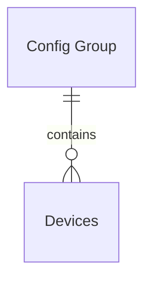

# IoT Agent API

# Preface

The IoT Agent mission is to provide a common abstraction layer between the devices and the NGSI entities stored in
Context Broker. In order to achieve this, the IoT Agent sits between the Context Broker and a set of devices. It is in
charge of translating the information coming from the devices into NGSI requests and viceversa.

The **IoT Agent node library** is a Node.js module that can be used to implement IoT Agents. It provides a set of common
functionality that can be used to implement the different IoT Agents, offering a simple REST API which provides common
functionality to access, provision and decommission devices and groups of devices. This document describes the API
provided by the IoT Agent node library.

# Topics

## Terminology

-   **Devices**: A resource that match physical devices that are connected to the IoT Agent. Each device has a set of
    attributes that can be read or written and a set of commands that can be invoked. The device is identified by a
    `device_id` and points particular entity in the context broker.
-   **Config Groups**: Also known as `provisioning groups` or `service groups`. A logical group of devices. Each Config
    Group has a set of attributes that can be read or written. The config group is identified by a an `apikey`, used to
    authenticate the requests coming from the devices.
-   **Measurements**: A set of values that are sent by a device to the IoT Agent.
-   **Service**: It is the `FIWARE-Service` that the device or config group belongs to.
-   **Subservice**: It is the specific `FIWARE-ServicePath` that the device or config group belongs to.

## IoT Agent information model

IoT Agents models 2 different kinds of resources: devices and config groups. Devices are the physical devices that send
measurements to the IoT Agent. Config groups are logical groups of devices that share the same configuration. A config
group contains zero or more devices.



### Config groups

Config groups provides a template configuration for the all devices that belong to them. This allows to provision a set
of devices with a single operation. They are identified by an `apikey` and a `resource` and mapped to a particular
entity type.

Once a measure is received by the IoT Agent, the `apikey` and `resource` are used to identify the config group to which
the device belongs. The config group is used to map the measure to a particular entity type and to provide the
information needed to interact with the Context Broker.

If the device already exists in the Context Broker, the IoT Agent will update the entity with the new values. If the
device does not exist, the IoT Agent will create it with the information provided by the config group and eventually
will also create the entity in the Context Broker. This last operation is only possible if the IoT Agent is configured
to use autoprovisioning.

For every config group, the pair (resource, apikey) _must_ be unique (as it is used to identify which group to assign to
which device). Those operations of the API targeting specific resources will need the use of the `resource` and `apikey`
parameters to select the appropriate instance.

Config groups can be created with preconfigured sets of attributes, service information, security information and other
parameters. The specific parameters that can be configured for a given service group are:

### Devices

A device contains the information that connects a physical device to a particular entity in the Context Broker. Devices
are identified by a `device_id`, and they are associated to an existing config group based in `apiKey` matching or
`type` matching (in the case `apiKey` matching fails). For instance, let's consider a situation in which a config group
has been provisioned with `type=X`/`apiKey=111` and no other config group has been provisioned.

The IoT Agents offer a provisioning API where devices can be preregistered, so all the information about service and
subservice mapping, security information and attribute configuration can be specified in a per device way instead of
relaying on the config group configuration.

## Entity attributes

In the group/device model there are four list of attributes that can be declared: `attributes`, `lazy`, `static` and
`commands`. Each of them have a different purpose and are used in different ways by the IoT Agent, but they are the way
to configure how the information coming from the device is mapped to the Context Broker attributes.

All of them have the same syntax, an object containing the following attributes:

-   **object_id** (optional): name of the attribute as coming from the device.
-   **name** (mandatory): ID of the attribute in the target entity in the Context Broker.
-   **type** (mandatory): name of the type of the attribute in the target entity.
-   **metadata** (optional): additional static metadata for the attribute in the target entity. (e.g. `unitCode`)

-   **`attributes`**: Are measures that are pushed from the device to the IoT agent. This measure changes will be sent
    to the Context Broker as u pdateContext requests over the device entity. NGSI queries to the context broker will be
    resolved in the Broker database. For each attribute, its `name` and `type` must be provided. Additional `metadata`
    is optional.

-   **`lazy`**: Passive measures that are pulled from the device to the IoT agent. When a request for data from a lazy
    attribute arrives to the Context Broker, it forwards the request to the Context Provider of that entity, in this
    case the IoT Agent. The IoT Agent will then ask the device for the information needed, transform that information to
    a NGSI format and return it to the Context Broker. This operation will be synchronous from the customer perspective:
    the Context Broker won't return a response until the device has returned its response to the IoT Agent. For each
    attribute, its `name` and `type` must be provided.

-   **`static`**: It is static attributes that are persisted in the Context Broker. They are not updated by the device,
    but they can be modified by the user. They are useful to store information about the device that is not updated by
    the device itself. For instance, a `location` static attribute is can be used to store the location of a fixed
    device.

-   **`commands`**: Commands are actions that can be invoked in the device. They are similar to attributes, but they are
    not updated by the device. They are updated by the Context Broker, and the IoT Agent will be in charge of
    translating the updateContext request to the proper action in the device. Two additional attributes are created for
    each command: `status` and `info`. For each command, its `name` and `type` must be provided.

Some transformation plugins also allow the use of the following optional fields:

-   **expression**: indicates that the value of the target attribute will not be the plain value or the measurement, but
    an expression based on a combination of the reported values. See the
    [Expression Language definition](expressionLanguage.md) for details
-   **entity_name**: the presence of this attribute indicates that the value will not be stored in the original device
    entity but in a new entity with an ID given by this attribute. The type of this additional entity can be configured
    with the `entity_type` attribute. If no type is configured, the device entity type is used instead. Entity names can
    be defined as expressions, using the [Expression Language definition](expressionLanguage.md).
-   **entity_type**: configures the type of an alternative entity.
-   **reverse**: add bidirectionality expressions to the attribute. See the **bidirectionality** transformation plugin
    in the [Data Mapping Plugins section](advanced-topics.md#bidirectionality-plugin-bidirectional) for details.

Additionally for commands (which are attributes of type `command`) the following fields are optional:

-   **expression** indicates that the value of the target command will not be the plain value or the command, but an
    expression based on a combination of the returned values. See the
    [Expression Language definition](expressionLanguage.md) for details
-   **payloadType**: indicates how command payload will be transformed before be sent to device. Please have a look to
    particular IOTAs documentation for allowed values of this field in each case.
-   **contentType**: `content-type` header used when send command by HTTP transport (ignored in other kinds of
    transports)

## Advice on Attribute defintions

### Reuse of attribute names

Check for the existence of the same Attribute on any of the other models and reuse it, if pertinent. Have a look at
schema.org trying to find a similar term with the same semantics. Try to find common used ontologies or existing
standards well accepted by the Community, or by goverments, agencies, etc. For instance, Open311 for civic issue
tracking or Datex II for transport systems.

### Reuse of attribute types

When possible reuse [schema.org](http://schema.org/) data types (`Text`, `Number`, `DateTime`, `StructuredValue`, etc.).
Remember that `null` is not allowed in NGSI-LD and therefore should be avoided as a value.

### How to specify attribute Units of Measurement

If your data use the default unit defined in the Data Model, you don't need to specify any. It is implied. Unless
explicitly stated otherwise, all FIWARE data models use the metric system of measurements by default. Regardless the
model specification include explicit reference to the scale adopted. If your data use a different unit, you will need to
use the `unitCode` metadata annotation in your data (and you will need to adopt the normalised representation). The code
used should be taken from those defined by
[UN/CEFACT](https://www.unece.org/fileadmin/DAM/cefact/recommendations/rec20/rec20_rev3_Annex3e.pdf). E.g.:

```json
{
    "object_id": "l",
    "name": "length",
    "type": "Integer",
    "metadata": {
        "unitCode": { "type": "Text", "value": "FOT" }
    }
}
```

## Securized acces

**trust** token to use for secured access to the Context Broker for this type of devices (optional; only needed for
secured scenarios). Trust tokens may be called `access_tokens` by some Oauth2 providers.

## Overriding global Context Broker host

**cbHost**: Context Broker host URL. This option can be used to override the global CB configuration for specific types
of devices.

### Multitenancy, FIWARE Service and FIWARE ServicePath

Every operation in the API require the `fiware-service` and `fiware-servicepath` to be defined; the operations are
performed in the scope of those headers. For the list case, the special wildcard servicepath can be specified, `/*`. In
this case, the operation applies to all the subservices of the service given by the `fiware-service` header.

# API Routes

## Config group API

### Config group datamodel

Config group is represented by a JSON object with the following fields:

| Field                          | Optional | Type           | Expression | Definitiom                                                                                                                                                                                                                                                                |
| ------------------------------ | -------- | -------------- | ---------- | ------------------------------------------------------------------------------------------------------------------------------------------------------------------------------------------------------------------------------------------------------------------------- |
| `service`                      |          | string         |            | `FIWARE-Service` header to be used                                                                                                                                                                                                                                        |
| `subservice`                   |          | string         |            | Subservice of the devices of this type.                                                                                                                                                                                                                                   |
| `resource`                     |          | string         |            | string representing the Southbound resource that will be used to assign a type to a device (e.g.: pathname in the southbound port).                                                                                                                                       |
| `apikey`                       |          | string         |            | API Key string.                                                                                                                                                                                                                                                           |
| `timestamp`                    | ✓        | bool           |            | Optional flag about whether or not to add the `TimeInstant` attribute to the device entity created, as well as a `TimeInstant` metadata to each attribute, with the current timestamp. With NGSI-LD, the Standard `observedAt` property-of-a-property is created instead. |
| `entity_type`                  |          | string         |            | name of the Entity `type` to assign to the group.                                                                                                                                                                                                                         |
| `trust`                        | ✓        | string         |            | trust token to use for secured access to the Context Broker for this type of devices (optional; only needed for secured scenarios).                                                                                                                                       |
| `cbHost`                       | ✓        | string         |            | Context Broker connection information. This options can be used to override the global ones for specific types of devices.                                                                                                                                                |
| `lazy`                         | ✓        |                |            | list of common lazy attributes of the device. For each attribute, its `name` and `type` must be provided.                                                                                                                                                                 |
| `commands`                     | ✓        |                |            | list of common commands attributes of the device. For each attribute, its `name` and `type` must be provided, additional `metadata` is optional.                                                                                                                          |
| `attributes`                   | ✓        |                |            | list of common active attributes of the device. For each attribute, its `name` and `type` must be provided, additional `metadata` is optional.                                                                                                                            |
| `static_attributes`            | ✓        |                |            | this attributes will be added to all the entities of this group 'as is', additional `metadata` is optional.                                                                                                                                                               |
| `internal_attributes`          | ✓        |                |            | optional section with free format, to allow specific IoT Agents to store information along with the devices in the Device Registry.                                                                                                                                       |
| `expressionLanguage`           | ✓        | string         |            | optional boolean value, to set expression language used to compute expressions, possible values are: legacy or jexl. When not set or wrongly set, `legacy` is used as default value.                                                                                      |
| `explicitAttrs`                | ✓        | string or bool | ✓          | optional field to support selective ignore of measures so that IOTA doesn’t progress. See details in [specific section](advanced-topics.md#explicitly-defined-attributes-explicitattr)                                                                                    |
| `entityNameExp`                | ✓        | string         |            | optional field to allow use expressions to define entity name, instead default `id` and `type`                                                                                                                                                                            |
| `ngsiVersion`                  | ✓        | string         |            | optional string value used in mixed mode to switch between **NGSI-v2** and **NGSI-LD** payloads. Possible values are: `v2` or `ld`. The default is `v2`. When not running in mixed mode, this field is ignored.                                                           |
| `defaultEntityNameConjunction` | ✓        | string         |            | optional string value to set default conjunction string used to compose a default `entity_name` when is not provided at device provisioning time.                                                                                                                         |
| `autoprovision`                | ✓        | bool           | ✓?         | optional boolean: If `false`, autoprovisioned devices (i.e. devices that are not created with an explicit provision operation but when the first measure arrives) are not allowed in this group. Default (in the case of omitting the field) is `true`.                   |

### Config group operations

The following actions are available under the config group endpoint:

#### Create config group `POST /iot/services`

Creates a set of config groups for the given service and service path. The service and subservice information will taken
from the headers, overwritting any preexisting values.

_**Request headers**_

| Header               | Optional | Description                                                                                    | Example    |
| -------------------- | -------- | ---------------------------------------------------------------------------------------------- | ---------- |
| `Fiware-Service`     | ✓        | Tenant or service. See subsection [Multi tenancy](#multi-tenancy) for more information.        | `acme`     |
| `Fiware-ServicePath` | ✓        | Service path or subservice. See subsection [Service Path](#service-path) for more information. | `/project` |

_**Request payload**_

A JSON object with a `services` field. The value is an array of config groups objects to create. See the
[config group datamodel](#service-group-datamodel) for more information.

Example:

```json
{
    "services": [
        {
            "resource": "/deviceTest",
            "apikey": "801230BJKL23Y9090DSFL123HJK09H324HV8732",
            "type": "Light",
            "trust": "8970A9078A803H3BL98PINEQRW8342HBAMS",
            "cbHost": "http://orion:1026",
            "commands": [{ "name": "wheel1", "type": "Wheel" }],
            "attributes": [
                {
                    "name": "luminescence",
                    "type": "Integer",
                    "metadata": {
                        "unitCode": { "type": "Text", "value": "CAL" }
                    }
                }
            ],
            "lazy": [{ "name": "status", "type": "Boolean" }]
        }
    ]
}
```

_**Response code**_

-   `200` `OK` if successful, with no payload.
-   `400` `MISSING_HEADERS` if any of the mandatory headers is not present.
-   `400` `WRONG_SYNTAX` if the body doesn't comply with the schema.
-   `500` `SERVER ERROR` if there was any error not contemplated above.

_**Response headers**_

Successful operations return `Content-Type` header with `application/json` value.

#### List services group `GET /iot/services`

List all the config groups for the given `fiware-service` and `fiware-servicepath`. If the `fiware-servicepath` header
has the wildcard expression, `/*`, all the config groups for that `fiware-service` are returned. The config groups that
match the `fiware-servicepath` are returned in any other case.

_**Request headers**_

| Header               | Optional | Description                                                                                    | Example    |
| -------------------- | -------- | ---------------------------------------------------------------------------------------------- | ---------- |
| `Fiware-Service`     | ✓        | Tenant or service. See subsection [Multi tenancy](#multi-tenancy) for more information.        | `acme`     |
| `Fiware-ServicePath` | ✓        | Service path or subservice. See subsection [Service Path](#service-path) for more information. | `/project` |

_**Response code**_

-   200 OK if successful, returning a config group body.
-   400 MISSING_HEADERS if any of the mandatory headers is not present.
-   500 SERVER ERROR if there was any error not contemplated above.

_**Response headers**_

Successful operations return `Content-Type` header with `application/json` value.

_**Response payload**_

A JSON object with a services field that contains an array of services that match the request. See the
[config group datamodel](#service-group-datamodel) for more information.

Example:

```json
{
    "services": [
        {
            "resource": "/deviceTest",
            "apikey": "801230BJKL23Y9090DSFL123HJK09H324HV8732",
            "type": "Light",
            "trust": "8970A9078A803H3BL98PINEQRW8342HBAMS",
            "cbHost": "http://orion:1026",
            "commands": [{ "name": "wheel1", "type": "Wheel" }],
            "attributes": [
                {
                    "name": "luminescence",
                    "type": "Integer",
                    "metadata": {
                        "unitCode": { "type": "Text", "value": "CAL" }
                    }
                }
            ],
            "lazy": [{ "name": "status", "type": "Boolean" }]
        },
        {
            "resource": "/deviceTest2",
            "apikey": "A21323ASDG12312ASDN21LWQEJPO2J123",
            "type": "Switch",
            "trust": "8970A9078A803H3BL98PINEQRW8342HBAMS",
            "cbHost": "http://orion:1026",
            "commands": [{ "name": "on", "type": "order" }],
            "attributes": [
                {
                    "name": "swithc_status",
                    "type": "boolean"
                }
            ]
        }
    ]
}
```

#### Modify config group `PUT /iot/services`

Modifies the information of a config group, identified by the `resource` and `apikey` query parameters. Takes a service
group body as the payload. The body does not have to be complete: for incomplete bodies, just the attributes included in
the JSON body will be updated. The rest of the attributes will remain unchanged.

_**Request query parameters**_

| Parameter | Mandatory | Description                                  | Example                                   |
| --------- | --------- | -------------------------------------------- | ----------------------------------------- |
| resource  | ✓         | Resource of the config group to be modified. | `/device`                                 |
| apikey    | ✓         | Apikey of the config group to be modified.   | `801230BJKL23Y9090DSFL123HJK09H324HV8732` |

_**Request headers**_

| Header               | Optional | Description                                                                                    | Example    |
| -------------------- | -------- | ---------------------------------------------------------------------------------------------- | ---------- |
| `Fiware-Service`     | ✓        | Tenant or service. See subsection [Multi tenancy](#multi-tenancy) for more information.        | `acme`     |
| `Fiware-ServicePath` | ✓        | Service path or subservice. See subsection [Service Path](#service-path) for more information. | `/project` |

_**Request payload**_

A JSON object with the config group information to be modified. See the
[config group datamodel](#service-group-datamodel) for more information.

Example:

```json
{
    "trust": "8970A9078A803H3BL98PINEQRW8342HBAMS",
    "cbHost": "http://orion:1026"
}
```

_**Response code**_

-   200 OK if successful, returning the updated body.
-   400 MISSING_HEADERS if any of the mandatory headers is not present.
-   500 SERVER ERROR if there was any error not contemplated above.:

#### DELETE /iot/services `DELETE /iot/services`

Removes a config group, identified by the `resource` and `apikey` query parameters.

_**Request query parameters**_

| Parameter | Mandatory | Description                                 | Example                                   |
| --------- | --------- | ------------------------------------------- | ----------------------------------------- |
| resource  | ✓         | Resource of the config group to be removed. | `/device`                                 |
| apikey    | ✓         | Apikey of the config group to be removed.   | `801230BJKL23Y9090DSFL123HJK09H324HV8732` |

_**Request headers**_

| Header               | Optional | Description                                                                                    | Example    |
| -------------------- | -------- | ---------------------------------------------------------------------------------------------- | ---------- |
| `Fiware-Service`     | ✓        | Tenant or service. See subsection [Multi tenancy](#multi-tenancy) for more information.        | `acme`     |
| `Fiware-ServicePath` | ✓        | Service path or subservice. See subsection [Service Path](#service-path) for more information. | `/project` |

_**Response code**_

-   `200` `OK` if successful.
-   `400` `MISSING_HEADERS` if any of the mandatory headers is not present.
-   `500` `SERVER ERROR` if there was any error not contemplated above.

## Device API

### Device datamodel

The table below shows the information held in the Device resource. The table also contains the correspondence between
the API resource fields and the same fields in the database model.

| Field                 | Optional | Type      | Expression | Definitiom                                                                                                                                                                                                                                                       |
| --------------------- | -------- | --------- | ---------- | ---------------------------------------------------------------------------------------------------------------------------------------------------------------------------------------------------------------------------------------------------------------- |
| `device_id`           |          | `string`  |            | Device ID that will be used to identify the device.                                                                                                                                                                                                              |
| `service`             |          | `string`  |            | Name of the service the device belongs to (will be used in the fiware-service header).                                                                                                                                                                           |
| `service_path`        |          | `string`  |            | Name of the subservice the device belongs to (used in the fiware-servicepath header).                                                                                                                                                                            |
| `entity_name`         |          | `string`  |            | Name of the entity representing the device in the Context Broker                                                                                                                                                                                                 |
| `entity_type`         |          | `string`  |            | Type of the entity in the Context Broker                                                                                                                                                                                                                         |
| `timezone`            | ✓        | `string`  |            | Timezone of the device if that has any                                                                                                                                                                                                                           |
| `timestamp`           | ✓        | `string`  |            | Flag about whether or not to add the `TimeInstant` attribute to the device entity created, as well as a `TimeInstant` metadata to each attribute, with the current timestamp. With NGSI-LD, the Standard `observedAt` property-of-a-property is created instead. |
| `apikey`              | ✓        | `string`  |            | Apikey key string to use instead of group apikey                                                                                                                                                                                                                 |
| `endpoint`            | ✓        | `string`  |            | Endpoint where the device is going to receive commands, if any.                                                                                                                                                                                                  |
| `protocol`            | ✓        | `string`  |            | Pame of the device protocol, for its use with an IoT Manager                                                                                                                                                                                                     |
| `transport`           | ✓        | `string`  |            | Transport protocol used by the device to send updates, for the IoT Agents with multiple transport protocols.                                                                                                                                                     |
| `attributes`          | ✓        | `array`   |            | List of attributes that will be stored in the Context Broker.                                                                                                                                                                                                    |
| `commands`            | ✓        | `array`   |            | List of commands that will be stored in the Context Broker.                                                                                                                                                                                                      |
| `lazy`                | ✓        | `array`   |            | List of lazy attributes that will be stored in the Context Broker.                                                                                                                                                                                               |
| `static_attributes`   | ✓        | `array`   |            | List of static attributes that will be stored in the Context Broker.                                                                                                                                                                                             |
| `internal_attributes` | ✓        | `array`   |            | List of internal attributes with free format for specific IoT Agent configuration.                                                                                                                                                                               |
| `expression_language` | ✓        | `string`  |            | Expression language used in the expressions. Possible values are: `legacy` or `jexl`. When not set or wrongly set, legacy is used as default value.                                                                                                              |
| `explicitAttrs`       | ✓        | `boolean` | ✓          | Field to support selective ignore of measures so that IOTA doesn’t progress. See details in [specific section](advanced-topics.md#explicitly-defined-attributes-explicitattrs)                                                                                   |
| `mgsiVersion`         | ✓        | `string`  |            | string value used in mixed mode to switch between **NGSI-v2** and **NGSI-LD** payloads. The default is `v2`. When not running in mixed mode, this field is ignored.                                                                                              |

### Device list operations

#### List devices /iot/devices `GET /iot/devices`

List all the devices registered in the IoT Agent device registry with all their information for a given `fiware-service`
and `fiware-servicepath`.

_**Request query parameters**_

| Parameter | Mandatory | Description                                               | Example |
| --------- | --------- | --------------------------------------------------------- | ------- |
| `limit`   |           | Maximum number of results to return in a single response. | `20`    |
| `offset`  |           | Number of results to skip from the original query.        | `0`     |

_**Request headers**_

| Header               | Optional | Description                                                                                    | Example    |
| -------------------- | -------- | ---------------------------------------------------------------------------------------------- | ---------- |
| `Fiware-Service`     | ✓        | Tenant or service. See subsection [Multi tenancy](#multi-tenancy) for more information.        | `acme`     |
| `Fiware-ServicePath` | ✓        | Service path or subservice. See subsection [Service Path](#service-path) for more information. | `/project` |

_**Response code**_

-   `200` `OK` if successful.
-   `404` `NOT FOUND` if there are no devices for the given service and subservice.
-   `500` `SERVER ERROR` if there was any error not contemplated above.

_**Response headers**_

Successful operations return `Content-Type` header with `application/json` value.

_**Response body**_

The response body contains a JSON object with the following fields:

| Field     | Type      | Description                                                                                                                                                                        |
| --------- | --------- | ---------------------------------------------------------------------------------------------------------------------------------------------------------------------------------- |
| `count`   | `integer` | Number of devices in the response.                                                                                                                                                 |
| `devices` | `array`   | List of devices in the response. Each device is represented by a JSON object. For more information about the device object, see the [Device datamodel](#device-datamodel) section. |

Example:

```json
{
    "count": 2,
    "devices": [
        {
            "device_id": "DevID0",
            "service": "ServiceTest",
            "service_path": "/testSubservice",
            "entity_name": "urn:ngsi-ld:Device:TheDevice0",
            "entity_type": "Device",
            "attributes": [
                { "object_id": "t", "name": "temperature", "type": "Float" },
                { "object_id": "h", "name": "humidity", "type": "Float" }
            ],
            "lazy": [],
            "static_attributes": [],
            "internal_attributes": []
        },
        {
            "device_id": "DevID1",
            "service": "ServiceTest",
            "service_path": "/testSubservice",
            "entity_name": "urn:ngsi-ld:Device:TheDevice1",
            "entity_type": "Device",
            "attributes": [
                { "object_id": "t", "name": "temperature", "type": "Float" },
                {
                    "object_id": "l",
                    "name": "percentage",
                    "type": "Integer",
                    "metadata": {
                        "unitCode": { "type": "Text", "value": "P1" }
                    }
                }
            ],
            "lazy": [{ "object_id": "h", "name": "humidity", "type": "Float" }],
            "static_attributes": [{ "name": "serialID", "value": "02598347", "type": "Text" }],
            "internal_attributes": []
        }
    ]
}
```

##### Create device `POST /iot/devices`

Provision a new device in the IoT Agent's device registry for a given `fiware-service` and `fiware-servicepath`. Takes a
Device in JSON format as the payload.

_**Request headers**_

| Header               | Optional | Description                                                                                    | Example    |
| -------------------- | -------- | ---------------------------------------------------------------------------------------------- | ---------- |
| `Fiware-Service`     | ✓        | Tenant or service. See subsection [Multi tenancy](#multi-tenancy) for more information.        | `acme`     |
| `Fiware-ServicePath` | ✓        | Service path or subservice. See subsection [Service Path](#service-path) for more information. | `/project` |

_**Request body**_

The body of the a JSON object with field named `devices` containing a list of devices to be provisioned. Each device is
represented by device JSON object. For more information, see the [Device datamodel](#device-datamodel) section.

Example:

```json
{
    "devices": [
        {
            "device_id": "DevID1",
            "entity_name": "urn:ngsi-ld:Device:TheDevice1",
            "entity_type": "Device",
            "attributes": [
                { "object_id": "t", "name": "temperature", "type": "Float" },
                { "object_id": "h", "name": "humidity", "type": "Float" }
            ]
        }
    ]
}
```

_**Response code**_

-   `200` `OK` if successful.
-   `500` `SERVER ERROR` if there was any error not contemplated above.

### Device by ID operations

#### Get device details `GET /iot/devices/:deviceId`

Returns all the information about a device in the IoT Agent's device registry for a given `fiware-service` and
`fiware-servicepath`.

_**Request URL parameters**_

| Parameter  | Mandatory | Description | Example  |
| ---------- | --------- | ----------- | -------- |
| `deviceId` | ✓         | Device ID.  | `DevID1` |

_**Request headers**_

| Header               | Optional | Description                                                                                    | Example    |
| -------------------- | -------- | ---------------------------------------------------------------------------------------------- | ---------- |
| `Fiware-Service`     | ✓        | Tenant or service. See subsection [Multi tenancy](#multi-tenancy) for more information.        | `acme`     |
| `Fiware-ServicePath` | ✓        | Service path or subservice. See subsection [Service Path](#service-path) for more information. | `/project` |

_**Response code**_

-   `200` `OK` if successful.
-   `404` `NOT FOUND` if the device was not found in the database.
-   `500` `SERVER ERROR` if there was any error not contemplated above.

_**Response headers**_

Successful operations return `Content-Type` header with `application/json` value.

_**Response body**_

The response body contains a device JSON object. For more information, see the [Device datamodel](#device-datamodel)
section.

Example:

```json
{
    "device_id": "DevID1",
    "service": "ServiceTest",
    "service_path": "/testSubservice",
    "entity_name": "urn:ngsi-ld:Device:0001",
    "entity_type": "Device",
    "attributes": [
        { "object_id": "t", "name": "temperature", "type": "Float" },
        {
            "type": "Integer",
            "name": "percentage",
            "metadata": {
                "unitCode": { "type": "Text", "value": "P1" }
            },
            "object_id": "l"
        }
    ],
    "lazy": [{ "object_id": "h", "name": "humidity", "type": "Float" }],
    "static_attributes": [{ "name": "serialID", "value": "02598347", "type": "Text" }],
    "internal_attributes": []
}
```

#### Delete device `DELETE /iot/devices/:deviceId`

Remove a device from the device registry. The device is identified by the Device ID as URL parameter.

_**Request URL parameters**_

| Parameter  | Mandatory | Description             | Example  |
| ---------- | --------- | ----------------------- | -------- |
| `deviceId` | ✓         | Device ID to be deleted | `DevID1` |

_**Request headers**_

| Header               | Optional | Description                                                                                    | Example    |
| -------------------- | -------- | ---------------------------------------------------------------------------------------------- | ---------- |
| `Fiware-Service`     | ✓        | Tenant or service. See subsection [Multi tenancy](#multi-tenancy) for more information.        | `acme`     |
| `Fiware-ServicePath` | ✓        | Service path or subservice. See subsection [Service Path](#service-path) for more information. | `/project` |

_**Response code**_

-   `200` `OK` if successful.
-   `404` `NOT FOUND` if the device was not found in the database.
-   `500` `SERVER ERROR` if there was any error not contemplated above.

#### Modify device `PUT /iot/devices/:deviceId`

Changes the stored values for the device with the provided Device payload. Neither the name, the type nor the ID of the
device can be changed using this method (as they are used to link the already created entities in the Context Broker to
the information in the device). `fiware-service` and `fiware-servicepath`, being taken from the headers, can't be
changed also.

_**Request URL parameters**_

| Parameter  | Mandatory | Description             | Example  |
| ---------- | --------- | ----------------------- | -------- |
| `deviceId` | ✓         | Device ID to be updated | `DevID1` |

_**Request headers**_

| Header               | Optional | Description                                                                                    | Example    |
| -------------------- | -------- | ---------------------------------------------------------------------------------------------- | ---------- |
| `Fiware-Service`     | ✓        | Tenant or service. See subsection [Multi tenancy](#multi-tenancy) for more information.        | `acme`     |
| `Fiware-ServicePath` | ✓        | Service path or subservice. See subsection [Service Path](#service-path) for more information. | `/project` |

_**Request body**_

The request body contains a device JSON object the values of which will be updated in the device registry. For more
information, see the [Device datamodel](#device-datamodel) section.

Example:

```json
{
    "attributes": [
        { "object_id": "t", "name": "temperature", "type": "Float" },
        { "object_id": "h", "name": "humidity", "type": "Float" },
        { "object_id": "p", "name": "pressure", "type": "Float" }
    ],
    "lazy": [{ "object_id": "l", "name": "luminosity", "type": "percentage" }],
    "commands": [{ "object_id": "t", "name": "turn", "type": "Text" }],
    "static_attributes": [{ "name": "serialID", "type": "02598347" }]
}
```

_**Response code**_

-   `200` `OK` if successful.
-   `404` `NOT FOUND` if the device was not found in the database.
-   `500` `SERVER ERROR` if there was any error not contemplated above.

## Miscellaneous API

### Log operations

The IoT Agent Library makes use of the [Logops logging library](https://github.com/telefonicaid/logops). The IoT Agent
Library provides a configuration API that lets the administrator change and manage the log level in realtime.

#### Modify Loglevel `PUT /admin/log`

This operation gets the new log level using the query parameter `level`. If the new level is a valid level, it will be
automatically changed for future logs.

_**Request query parameters**_

| Parameter | Mandatory | Description                                                                                                         | Example |
| --------- | --------- | ------------------------------------------------------------------------------------------------------------------- | ------- |
| `level`   | ✓         | New log level. One of the following: `INFO`, `ERROR`, `FATAL`, `DEBUG`, `WARNING`. it will be automatically changed |

for future logs. | `DEBUG` |

_**Response code**_

-   `200` `OK` if successful.
-   `500` `SERVER ERROR` if there was any error not contemplated above.

#### Retrieve log level `PUT /admin/log`

_**Response code**_

-   `200` `OK` if successful.
-   `500` `SERVER ERROR` if there was any error not contemplated above.

_**Response body**_

Returns the current log level, in a json payload with a single attribute `level`.

Example:

```json
{
    "level": "DEBUG"
}
```

### About operations

#### List IoTA Information `GET /iot/about`

Returns a useful information about component version and deployment information. It can be used as a heartbeat operation
to check the health of the IoT Agent if required.

_**Response payload**_

The response is a JSON object with the following parameters:

-   `libVersion`: This field is the iotagent-node-lib version with which the IoT Agent has been developed.
-   `port`: port where the IoT Agent will be listening as a Context Provider.
-   `baseRoot`: base root to prefix all the paths where the IoT Agent will be listening as a Context Provider.
-   `version`: This field is the IoT Agent version. It will be read from the `iotaVersion` field of the config, if it
    exists.

Example:

```json
{
    "libVersion": "2.7.0",
    "port": "4041",
    "baseRoot": "/",
    "version": "1.7.0"
}
```
