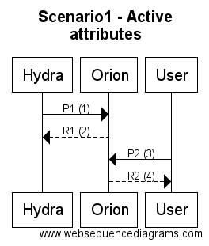
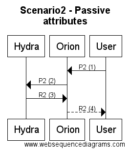
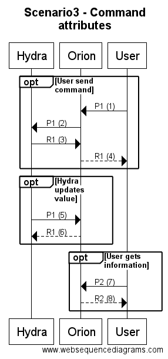

# Northbound NGSI Interactions

## Index

* [Overview](#overview)
* [Requirements](#requirements)
* [Theory](#theory)
  * [Overview](#theoryoverview)
  * [Data interaction payloads (NGSIv10)](#payloads)
  * [Scenario 1: active attributes](#scn1active)
  * [Scenario 2: lazy attributes](#scn2lazy)
  * [Scenario 3: command attributes](#scn3command)
  * [How to select an scenario](#scenarioselection)
* [Practice](#practice)
  * [Overview](#practiceoverview)
  * [Retrieving a token](#token)
  * [Scenario 1: active attributes (happy path)](#activehp)
  * [Scenario 1: active attributes (error)](#activeerror)
  * [Scenario 2: lazy attributes (happy path)](#lazyhp)
  * [Scenario 2: lazy attributes (error)](#lazyerror)
  * [Scenario 3: commands (happy path)](#commandshp)
  * [Scenario 3: commands (error)](#commandserror)

## <a name="overview"/> Overview
This document's target is to explain in detail how the IoTAgent interacts with the Context Broker in all the possible
IoT Scenarios that are supported by this library.

This document has two sections. In the first section, all the interaction models will be explained theoretically with
sequence diagrams, including the advantages and disadvantages of each one of them for different scenarios. The second
section will show examples of all those interactions, using command-line tools available in most OSs, like netcat and
curl.

All the examples have been created to work against Telefonica's IoT Platform so, along with the NGSI data, the following
information should always be sent:

* Headers for the service and subservice. A service "workshop" with subservice "/iota2ngsi" will be used.
* X-Auth-Token header with a valid unexpired token for a user that has admin permissions in the subservice. In this case
the user "adminiota2ngsi" will be used for all interactions

## <a name="requirements"/> Requirements
The practical part of this document has the following requirements:

* A Unix-line command line interpreter. All the workshop will take place in the command line, making use of different
command-line tools to simulate the different interactions.

* Curl command-line HTTP client should be installed.

* Netcat network utility should be installed.

* An accesible IoT Platform with the following configured components: Keystone, Steelskin PEP and Orion Context Broker.

* Basic knowledge of the NGSI model and HTTP interfaces.

## <a name="theory"/> Theory

### <a name="theoryoverview"/> Overview

#### General purpose of the IoT Agents
Inside the FIWARE Architecture, the IoT Agents work as protocol translation gateways, used to fill the gap between
South Bound protocols (typically lightweight protocols aimed to constrained devices) and the NGSI protocol used to
communicate FIWARE components. This translation process can be customized by the user with provisioning instructions,
using the Device Provisioning APIs.

So, all IoT Agents interacts with three different actors:
* **Devices**, in the South Bound
* **Users** through the Provisioning API
* and the **Context Broker**

In this document, we are going to focus on the NGSI interactions between the IoTAgents and the Context Broker, but
the three actors will appear eventually in sequence diagrams, as all of them take part at some point in the interactions.

All the interactions between the IoTAgents and the Context Broker are standard NGSI, as described in the
[Fiware Orion Context Broker manual](https://fiware-orion.readthedocs.io/en/master/user/walkthrough_apiv1/index.html#ngsi10-standard-operations).

The general purpose of the interactions between both components is:
* To map device information coming to the IoTA to NGSI entities in the Context Broker.
* To ask for device data from the Context Broker through the Context Provider mechanism.
* To send commands to devices based on modifications of the device entity in the Context Broker.

This interactions can be mapped to three different scenarios (that will be detailed in further sections).

#### Synchronous interactions

Along this document, the term "synchronous interaction" will be widely used, so we will define its specific meaning here.
Inside the scope of the IoTAgents documentation, a "synchronous scenario" will have the following definition:

```
Synchronous scenario is the one in which the actor that initiates the communication leaves its HTTP
socket open waiting for the response until all the interaction scenario ends, receiving the results
through the same socket that initiated the request
```

### <a name="payloads"/> Data interaction payloads (NGSIv10)

There are only two kinds of possible data interactions between the IoTAgents and the Context Broker: the queryContext and
updateContext interactions described in NGSIv10. Lots of examples can be found in the
[Fiware Orion Context Broker manual](https://fiware-orion.readthedocs.io/en/master/user/walkthrough_apiv1/index.html#ngsi10-standard-operations)
but this section shows some examples of each one of them.

There are six different payloads that may appear in this interactions:

* P1 - UpdateContext (request) - The payload of a request to POST /v1/updateContext
* R1 - UpdateContext (response) - Always the answer to a successful POST /v1/updateContext
* P2 - QueryContext (request) - he payload of a request to POST /v1/queryContext
* R2 - QueryContext (response) - Always the answer to a successful POST /v1/queryContext
* E1 - Error - Always the response to a request (both queryContext or updateContext)

All the interactions have been labeled with a two letter acronym for its use in the subsequent explanations.

No other type of payload can be issued in any interaction between this two components.

The following subsections will show examples of each one of them, with a brief explanation. Refer to the linked NGSI
documentation for more details.

#### P1 - UpdateContext (request)

This payload is associated to an update operation (POST /v1/updateContext).

```
{
    "contextElements": [
        {
            "type": "Room",
            "isPattern": "false",
            "id": "Room1",
            "attributes": [
                {
                    "name": "temperature",
                    "type": "float",
                    "value": "23"
                },
                {
                    "name": "pressure",
                    "type": "integer",
                    "value": "720"
                }
            ]
        }
    ],
    "updateAction": "APPEND"
}
```
As it can be seen in the example, the payload is a JSON Object with the following attributes:

* A `contextElements` attribute that contains the data that will be updated in the target entity in the `attributes`
attribute, along with the information needed to identify the target entity `id` and `type` attributes. This attribute
is an array, so a single updateContext operation can be used to update.

* An `updateAction` indicating the type of update: if this attribute has the value "APPEND" the appropriate entity and
attributes will be created if the don't exist; if the value is "UPDATE", an error will be thrown if the target resources
don't exist.

#### R1 - UpdateContext (response)

```
{
    "contextResponses": [
        {
            "contextElement": {
                "attributes": [
                    {
                        "name": "temperature",
                        "type": "float",
                        "value": ""
                    },
                    {
                        "name": "pressure",
                        "type": "integer",
                        "value": ""
                    }
                ],
                "id": "Room1",
                "isPattern": "false",
                "type": "Room"
            },
            "statusCode": {
                "code": "200",
                "reasonPhrase": "OK"
            }
        }
    ]
}
```
As the example shows, the response to an updateContext is basically an empty copy of the request payload, along with an
`statusCode` attribute indicating if the operation has succeeded (or a possible error).

Application level errors can be specified for each entity in this payload.


#### P2 - QueryContext (request)
This payload is associate to a query operation (POST /v1/queryContext).

```
{
    "entities": [
        {
            "type": "Room",
            "isPattern": "false",
            "id": "Room1"
        }
    ],
    "attributes": [
        "temperature"
    ]
}
```
The payload specifies the following information:

* The list of target entities whose information is going to be retrieved.
* The list of attributes of those entities that will be retrieved.


#### R2 - QueryContext (response)

```
{
    "contextResponses": [
        {
            "contextElement": {
                "attributes": [
                    {
                        "name": "temperature",
                        "type": "float",
                        "value": "23"
                    }
                ],
                "id": "Room1",
                "isPattern": "false",
                "type": "Room"
            },
            "statusCode": {
                "code": "200",
                "reasonPhrase": "OK"
            }
        }
    ]
}
```
In this case, the response to the QueryContext is a list of responses, one for each requested entity, indicating whether
the information has been retrieved successfully (in the `statusCode` field) and the requested Context information in the
`ContextElement` attribute.

Application level errors can be specified for each entity in this payload.

#### E1 - Error

```
{
    "errorCode": {
        "code": "404",
        "reasonPhrase": "No context element registrations found"
    }
}
```

This special payload can be used to specify general errors with the request, that are not associated to any particular
Context Element, but with the request as a whole.

### <a name="scn1active"/> Scenario 1: active attributes



In this scenario, the interaction is started by the device, that is going to actively send a piece of data to the
platform. When the IoTAgent receives the data, it sends it to the Context Broker through a P1 request. The Context Broker
then stores that information locally and returns a R1 indicating the request has succeeded. This interaction is 100%
synchronous from the perspective of the device (all the interaction happens through a single HTTP request and response
in the same socket).

This scenario leaves all the data locally stored in the Context Broker, so the user can query them using the standard
NGSI APIs offered by the Context Broker (including subscriptions). This data queries are completely separate from the
updating process, and can occur at any time (they are to completely different process).

### <a name="scn2lazy"/> Scenario 2: lazy attributes



This scenario requires that the attributes that are going to be requested are marked as provided by the IoT Agent, through
a registration process (NGSIv9). Examples of this registration process will be provided in the practical section of this
document. It's worth mentioning that Orion Context Broker **will not** store locally any data about attributes registered
as provided by a Context Provider; all the queries and updates to registered attributes will be redirected to their
Context Providers.

This interaction scenario is started by the User, that makes a query request, P2, to the Context Broker (1). The later,
detecting a Context Provider for the attribute, will forward the exact same query, P2,  to the IoTAgent (2). The IoTA
will then ask the devices for the required information (or it will retrieve it from its own database in case it stores a copy
of the data). With that information, it will answer with a R2 response payload to the Context Broker, as the HTTP answer
for the original Context Broker request (3). This R2 response payload is the one containing all the information requested by
the User in the original request. Once it has all the information, the Context Broker will return the same R2 request to
the User, as the response to the original HTTP request (and thus, in the same HTTP socket that initiated the request) (4).

This scenario is 100% synchronous from the perspective of the User (and also 100% synchronous from the perspective of
the Context Broker).

This scenario can be used for both updates and queries. The only difference between both uses would be the set of actions
to use: updateContext actions for the update (and thus, P1 and R1 payloads); and queryContext actions for the queries
(and thus P2 and R2 payloads).

### <a name="scn3command"/> Scenario 3: commands



This scenario requires that the attributes that are going to be requested are marked as provided by the IoT Agent, through
a registration process (NGSIv9). Examples of this registration process will be provided in the practical section of this
document. It's worth mentioning that Orion Context Broker **will not** store locally any data about attributes registered
as provided by a Context Provider; all the queries and updates to registered attributes will be redirected to their
Context Providers.

This scenario is slighty different than the others in its use of the set of attributes of the entity. This scenario will
use three kinds of attributes:

* An attribute will be used as the *input attribute* (the attribute registered in the Context Provider). This input
attribute can be thought of as a command issued to the IoTAgent (from here the name of the scenario) whose value is the
set of arguments of the command. Only updateContext operations will be used to interact with this attributes.

* Another attribute will be used as the *result attribute*. This attribute will be updated from the IoTAgent, and its
value stored in the Context Broker. This attribute will contain the result of the command (this result can be information
in case the command was a "information retrieval" command or the result of an action if it was an "actuator command").
Typically, the name of this attribute will be the same of the input attribute, with an additional sufix ("_info").

* Another attribute with the same characteristics as the later will be used to indicate whether the command has ended
successfully or whether an error has been reported.

In this scenario, the interaction is also initiated by the User. The user starts the scenario by sending an update request P1
to the Context Broker, to the input attribute (1). The Context Broker redirects this same payload to the Context Provider
of the attribute (the IoTAgent) (2). The IoTA immediately answers the request by issuing an R1 (3). This response is not
the final answer to the query, and does not contain any usefull data apart from the status Code. Answering with a 200 code
to this request implies that the IoTAgent has accepted the command, but is yet to process it; once the IoTA has processed
the command, it will update the information. The Context Broker then forwards this same response to teh User who started
the interactions and all HTTP connections are closed (4). This part of the scenario is 100% synchronous for the User, but
does not provide him with the data he queried; it just initiates the asynchronous background process.

At some point in the future, the IoTAgent gets the data it needs to process the command. Then, it starts a new interaction
with the Context Broker, by sending a P1 update request to the Context Broker (5). This P1 payload is the one containing
all the information requested by the user. That information will be updated in the result attribute and no reference to
the input attribute is made in this request. The Context Broker returns a R1 answer to the IoTA, ending the HTTP interaction (6).

This scenario leaves all the data locally stored in the Context Broker, so the user can query them using the standard
NGSI APIs offered by the Context Broker (as shown in the (7) and (8) requests in the diagram). This data queries are
completely separate from the updating process, and can occur at any time (they are to completely different process).

### <a name="scenario selection"/> How to select an scenario

The three different scenarios can be used in different situations:

* **Scenario 1**: this scenario is aimed to interactions actively started by the Device.
* **Scenario 2**: designed for interactions started by the User that are fast enough to be performed synchronously (within the time of an HTTP timeout).
* **Scenario 3**: designed for interactions started by the User that are too slow to be performed synchrounously.

## <a name="practice"/> Practice

### <a name="practiceoverview"> Overview
The following sections will show a series of examples of all the interactions that can be found in each scenario.

Initial requests are shown as full Curl commands (that can be used to reproduce the example).

Redirections from the Context Broker are shown as HTTP Requests (the whole request as it is sent via TCP sockets is
shown).

For responses, just the status code and the response payload are shown.

Be sure to understand how each scenario works (as shown in the theory section) before reproducing the interactions.

Along this document, IP addresses and passwords will be concealed. Substitute the concealed passwords by your own.

A postman collection is available alongside this document to help in reproducing this examples. It can be found
[here](./doc/NorthboundInteractions.postman_collection).

### <a name="token"/> Retrieving a token

This scenario assumes that the IoTAgent is connected to an Orion Context Broker secured by a Steelskin PEP, so every
request to the Context Broker should be authenticated.

In order to retrieve a token from the Keystone Identity Manager, the following request can be used:
```
curl -X POST -H "Content-Type: application/json" -H "Accept: application/json" -d '{
	"auth": {
		"identity": {
			"methods": [
				"password"
			],
			"password": {
				"user": {
					"domain": {
						"name": "workshop"
					},
					"name": "adminiota2ngsi",
					"password": "<password-for-user>"
				}
			}
		}
	}

}' "http://<platform-ip>:5001/v3/auth/tokens"
```

Keystone will reply with the following answer (201 Created):
```
{
  "token": {
    "issued_at": "2016-10-10T07:32:40.160439Z",
    "extras": {
      "password_creation_time": "2016-10-07T13:28:48Z",
      "password_expiration_time": "2017-10-07T13:28:48Z"
    },
    "methods": [
      "password"
    ],
    "expires_at": "2016-10-10T08:32:40.160408Z",
    "user": {
      "domain": {
        "id": "<domain-id>",
        "name": "workshop"
      },
      "id": "<user-id>",
      "name": "adminiota2ngsi"
    }
  }
}
```

The User token that needs to be used in the authorization header will be returned in the headers section, in the
`X-Subject-Token`. This value should be appended in the `X-Auth-Token` header for all the requests made to the
Context Broker (as it will be seen in the examples).

### <a name="activehp"/> Scenario 1: active attributes (happy path)

In this scenario, a device actively sends data to the IoT Agent, that transforms that data into a NGSI request
that is sent to the Context Broker. This request has the following format (P1):
```
curl -X POST -H "Content-Type: application/json" -H "Accept: application/json" -H "Fiware-Service: workshop" \
    -H "Fiware-ServicePath:  /iota2ngsi " -H "X-Auth-Token: <Token>" -d '{
    "contextElements": [
        {
            "type": "device",
            "isPattern": "false",
            "id": "Dev0001",
            "attributes": [
                {
                    "name": "temperature",
                    "type": "number",
                    "value": "54"
                }
            ]
        }
    ],
    "updateAction": "APPEND"
} ' "https://<platform-ip>:10027/v1/updateContext"
```

If the request is correct, the Context Broker will reply with the following R1 response (200 OK):
```
{
  "contextResponses": [
    {
      "contextElement": {
        "type": "device",
        "isPattern": "false",
        "id": "Dev0001",
        "attributes": [
          {
            "name": "temperature",
            "type": "number",
            "value": ""
          }
        ]
      },
      "statusCode": {
        "code": "200",
        "reasonPhrase": "OK"
      }
    }
  ]
}
```

This will confirm that the attribute `temperature` has been stored locally in the Context Broker, and that its value
can be queried.

Whenever the User wants to query this value, he can use any of the NGSI mechanisms for retrieving data. E.g. he can
use a standard queryContext request, as the following one (P2):
```
curl -X POST -H "Content-Type: application/json" -H "Accept: application/json" -H "Fiware-Service: workshop" \
  -H "Fiware-ServicePath:  /iota2ngsi " -H "X-Auth-Token: <token>" -d '{
    "entities": [
        {
            "isPattern": "false",
            "id": "Dev0001",
            "type": "device"
        }
    ],
    "attributes": [
        "temperature"
    ]
}' "https://<platform-ip>:10027/v1/queryContext"
```

The Context Broker will reply with the updated data values in R2 format (200 OK):
```
{
  "contextResponses": [
    {
      "contextElement": {
        "type": "device",
        "isPattern": "false",
        "id": "Dev0001",
        "attributes": [
          {
            "name": "temperature",
            "type": "number",
            "value": "54"
          }
        ]
      },
      "statusCode": {
        "code": "200",
        "reasonPhrase": "OK"
      }
    }
  ]
}
```

### <a name="activeerror"/> Scenario 1: active attributes (error)

Two kind of errors can appear in this scenario. If there is an error updating the information, the Context Broker will
replay with a payload like the following:
```
{
  "contextResponses": [
    {
      "contextElement": {
        "type": "device",
        "isPattern": "false",
        "id": "Dev0001",
        "attributes": [
          {
            "name": "UnexistentAttribute",
            "type": "number",
            "value": ""
          }
        ]
      },
      "statusCode": {
        "code": "472",
        "reasonPhrase": "request parameter is invalid/not allowed",
        "details": "action: UPDATE - entity: [Dev0001, device] - offending attribute: UnexistentAttribute"
      }
    }
  ]
}
```
It is worth mentioning that the Context Broker will reply with a 200 OK status code, as in standard NGSI, the HTTP codes
refer to transport protocol level errors, while the status codes inside of a payload give information about the
application level protocol.

The example shows an error updating an unexistent attribute (due to the use of UPDATE instead of APPEND).

The following error payload is also valid in standard NGSI:
```
{
  "errorCode": {
    "code": "404",
    "reasonPhrase": "No context element found"
  }
}
```

Different kinds of errors can return their information in different formats, so NGSI implementations should check for
the existence of both.

### <a name="lazyhp"/> Scenario 2: lazy attributes (happy path)

Scenario 2 relies on the Context Provider mechanism of the Context Broker. For this scenario to work, the IoTAgent
must register its lazy attributes for each device, with a request like the following:
```
curl -X POST -H "Content-Type: application/json" -H "Accept: application/json" -H "Fiware-service: workshop" \
  -H "fiware-servicepath:  /iota2ngsi " -H "x-auth-token: <token>" -d '{
    "contextRegistrations": [
        {
            "entities": [
                {
                    "type": "device",
                    "isPattern": "false",
                    "id": "Dev0001"
                }
            ],
            "attributes": [
                {
                    "name": "config-value",
                    "type": "parameter",
                    "isDomain": "false"
                }
            ],
            "providingApplication": "http://<target-host>:1026"
        }
    ],
    "duration": "P1M"
}
' "https://<platform-ip>:10027/v1/registry/registerContext"
```
If everything has gone OK, the Context Broker will return the following payload:
```
{
  "duration": "P1M",
  "registrationId": "57fb4642fdc8301538a65a04"
}
```
This ID can be used to update the registration in the future.

The registration of the attributes is performed once in the lifetime of the Device.

In this scenario, a User actively asks for a particular piece of data from a device. The scenario starts with the
request from the User to the Context Broker (P2):

```
curl -X POST -H "Content-Type: application/json" -H "Accept: application/json" -H "Fiware-Service: workshop" \
  -H "Fiware-ServicePath:  /iota2ngsi " -H "X-Auth-Token: <token>" -d '{
    "entities": [
        {
            "isPattern": "false",
            "id": "Dev0001",
            "type": "device"
        }
    ],
    "attributes": [
    	"config-value"
    ]
}' "https://<platform-ip>:10027/v1/queryContext"
```

The Context Broker receives this request and detects that it can be served by a Context Provider (the IoT Agent), so
it redirects the exact same request to the IoT Agent. The following excerpt shows the full HTTP frame containing
the redirection data:
```
POST /v1/queryContext HTTP/1.1
Host: <target-host>:1026
fiware-service: workshop
Fiware-ServicePath: /iota2ngsi
X-Auth-Token: <token>
Accept: application/json
Content-length: 157
Content-type: application/json; charset=utf-8
Fiware-Correlator: f77eea0a-8ebe-11e6-bab7-fa163e78b904

{
  "entities" : [
    {
      "type" : "device",
      "isPattern" : "false",
      "id" : "Dev0001"
    }
  ],
  "attributes" : [
    "config-value"
  ]
}
```

If the requested data is available in the IoT Agent, it will answer with a R2 response (200 OK):
```
{
  "contextResponses": [
    {
      "contextElement": {
        "type": "device",
        "isPattern": "false",
        "id": "Dev0001",
        "attributes": [
          {
            "name": "config-value",
            "type": "number",
            "value": "94"
          }
        ]
      },
      "statusCode": {
        "code": "200",
        "reasonPhrase": "OK"
      }
    }
  ]
}
```
Once the Context Broker has IoTAgent answer, it will forward it to the user in the same socket the user used for
its original request (200 OK):
```
{
  "contextResponses": [
    {
      "contextElement": {
        "type": "device",
        "isPattern": "false",
        "id": "Dev0001",
        "attributes": [
          {
            "name": "config-value",
            "type": "number",
            "value": "94"
          }
        ]
      },
      "statusCode": {
        "code": "200",
        "reasonPhrase": "OK"
      }
    }
  ]
}
```

### <a name="lazyerror"/> Scenario 2: lazy attributes (error)

Being fully synchronous, errors for scenario 2 follow the same patterns as for scenario 1. If the IoTAgent returns an
error, that error must follow the NGSI payloads described in the Scenario 1 error defined above.

### <a name="commandshp"/> Scenario 3: commands (happy path)

#### Context Provider Registration
Scenario 3 relies on the Context Provider mechanism of the Context Broker. For this scenario to work, the IoTAgent
must register its commands for each device, with a request like the following:
```
curl -X POST -H "Content-Type: application/json" -H "Accept: application/json" -H "Fiware-service: workshop" \
  -H "fiware-servicepath:  /iota2ngsi " -H "x-auth-token: <token>" -d '{
    "contextRegistrations": [
        {
            "entities": [
                {
                    "type": "device",
                    "isPattern": "false",
                    "id": "Dev0001"
                }
            ],
            "attributes": [
                {
                    "name": "switch",
                    "type": "command",
                    "isDomain": "false"
                }
            ],
            "providingApplication": "http://<target-host>:1026/v1"
        }
    ],
    "duration": "P1M"
}
' "https://<platform-ip>:10027/v1/registry/registerContext"
```
If everything has gone OK, the Context Broker will return the following payload:
```
{
  "duration": "P1M",
  "registrationId": "41adf79dc5a0bba830a6f3824"
}
```
This ID can be used to update the registration in the future.

The registration of the commands is performed once in the lifetime of the Device.

#### Command Execution

Scenario 3 begins with the request for a command from the User to the Context Broker (P1):
```
curl -X POST -H "Content-Type: application/json" -H "Accept: application/json" -H "Fiware-Service: workshop" \
  -H "Fiware-ServicePath:  /iota2ngsi " -H "X-Auth-Token: <token>" -d '{
    "contextElements": [
        {
            "type": "device",
            "isPattern": "false",
            "id": "Dev0001",
            "attributes": [
                {
                    "name": "switch",
                    "type": "command",
                    "value": "54, 12"
                }
            ]
        }
    ],
    "updateAction": "UPDATE"
} ' "https://<platform-ip>:10027/v1/updateContext"
```
The Context Broker receives this command and detects that it can be served by a Context Provider (the IoT Agent), so
it redirects the exact same request to the IoT Agent. The following excerpt shows the full HTTP frame containing
the redirection data:
```
POST /v1/updateContext HTTP/1.1
Host: <target-host>:1026
fiware-service: workshop
Fiware-ServicePath: /iota2ngsi
X-Auth-Token: <token>
Accept: application/json
Content-length: 290
Content-type: application/json; charset=utf-8
Fiware-Correlator: 9cae9496-8ec7-11e6-80fc-fa163e734aab

{
  "contextElements" : [
    {
      "type" : "device",
      "isPattern" : "false",
      "id" : "Dev0001",
      "attributes" : [
        {
          "name" : "switch",
          "type" : "command",
          "value" : "54, 12"
        }
      ]
    }
  ],
  "updateAction" : "UPDATE"
}
```
The IoT Agent detects the selected attribute is a command, and replies to the Context Broker with the following
payload (200 OK):

```
{
  "contextResponses": [
    {
      "contextElement": {
        "type": "device",
        "isPattern": "false",
        "id": "Dev0001",
        "attributes": [
          {
            "name": "switch",
            "type": "command",
            "value": ""
          }
        ]
      },
      "statusCode": {
        "code": "200",
        "reasonPhrase": "OK"
      }
    }
  ]
}
```
This response just indicates that the IoT Agent has received the command successfully, and gives no information about
the requested information or command execution.

The Context Broker, forwards the same response to the user, thus replying the original request (200 OK):

```
{
  "contextResponses": [
    {
      "contextElement": {
        "type": "device",
        "isPattern": "false",
        "id": "Dev0001",
        "attributes": [
          {
            "name": "switch",
            "type": "command",
            "value": ""
          }
        ]
      },
      "statusCode": {
        "code": "200",
        "reasonPhrase": "OK"
      }
    }
  ]
}
```

At this point, the command has been issued to the IoTAgent and the User doesn't still know what the result of its
request will be.

#### Result reporting

Once the IoT Agent has executed the command or retrieved the information from the device, it reports the results
to the Context Broker, with an updateContext (P1):

```
curl -X POST -H "Content-Type: application/json" -H "Accept: application/json" -H "Fiware-Service: workshop" \
  -H "Fiware-ServicePath:  /iota2ngsi " -H "X-Auth-Token: <token>" -d '{
    "contextElements": [
        {
            "type": "device",
            "isPattern": "false",
            "id": "Dev0001",
            "attributes": [
                {
                    "name": "switch_info",
                    "type": "command_info",
                    "value": "Switched successfully!"
                },
                {
                    "name": "switch_status",
                    "type": "command_status",
                    "value": "OK"
                }
            ]
        }
    ],
    "updateAction": "APPEND"
} ' "https://<platform-ip>:10027/v1/updateContext"
```
This update does not modify the original command attribute, but two auxiliary attributes, that are not provided by the
IoT Agent (usually, those attributes has the same name as the command, with an added suffix).

The Context Broker replies to the IoT Agent with a R1 payload (200 OK):
```
{
  "contextResponses": [
    {
      "contextElement": {
        "type": "device",
        "isPattern": "false",
        "id": "Dev0001",
        "attributes": [
          {
            "name": "switch_info",
            "type": "command_info",
            "value": ""
          },
          {
            "name": "switch_status",
            "type": "command_status",
            "value": ""
          }
        ]
      },
      "statusCode": {
        "code": "200",
        "reasonPhrase": "OK"
      }
    }
  ]
}
```
This operation stores the retrieved values locally in the Context Broker, so it can be retrieved with standard NGSI
mechanisms.

#### Result query

Whenever the User wants to know the status and result of the command, he can query the information in the Context
Broker, using, for example, a standard queryContext request (P2):
```
curl -X POST -H "Content-Type: application/json" -H "Accept: application/json" -H "Fiware-Service: workshop" \
  -H "Fiware-ServicePath:  /iota2ngsi " -H "X-Auth-Token: <token>" -d '{
    "entities": [
        {
            "isPattern": "false",
            "id": "Dev0001",
            "type": "device"
        }
    ],
    "attributes": [
    	"switch_info",
    	"switch_status"
    ]
}' "https://<platform-ip>:10027/v1/queryContext"
```
The Context Broker replies with all the desired data, in R2 format (200 OK):
```
{
  "contextResponses": [
    {
      "contextElement": {
        "type": "device",
        "isPattern": "false",
        "id": "Dev0001",
        "attributes": [
          {
            "name": "switch_info",
            "type": "command_info",
            "value": "Switched successfully!"
          },
          {
            "name": "switch_status",
            "type": "command_status",
            "value": "OK"
          }
        ]
      },
      "statusCode": {
        "code": "200",
        "reasonPhrase": "OK"
      }
    }
  ]
}
```

### <a name="commandserror"/> Scenario 3: commands (error)

In Scenario 3, errors can happen asynchronously, out of the main interactions. When the IoTAgent detects an error
executing the underlying command (i.e.: an error connecting with the device, or an error in the device itself),
the error information can be updated with the same mechanism used for result reporting. E.g.:

```
curl -X POST -H "Content-Type: application/json" -H "Accept: application/json" -H "Fiware-Service: workshop" \
  -H "Fiware-ServicePath:  /iota2ngsi " -H "X-Auth-Token: <token>" -d '{
    "contextElements": [
        {
            "type": "device",
            "isPattern": "false",
            "id": "Dev0001",
            "attributes": [
                {
                    "name": "switch_info",
                    "type": "command_info",
                    "value": "The switch could not be switched due to the following error: switch blocked"
                },
                {
                    "name": "switch_status",
                    "type": "command_status",
                    "value": "ERROR"
                }
            ]
        }
    ],
    "updateAction": "APPEND"
} ' "https://<platform-ip>:10027/v1/updateContext"
```
In this case, the Context Broker reply with the following response (200 OK):
```
{
  "contextResponses": [
    {
      "contextElement": {
        "type": "device",
        "isPattern": "false",
        "id": "Dev0001",
        "attributes": [
          {
            "name": "switch_info",
            "type": "command_info",
            "value": ""
          },
          {
            "name": "switch_status",
            "type": "command_status",
            "value": ""
          }
        ]
      },
      "statusCode": {
        "code": "200",
        "reasonPhrase": "OK"
      }
    }
  ]
}
```

The User will acknowledge the error the next time he queries the Context Broker for information about the command.
